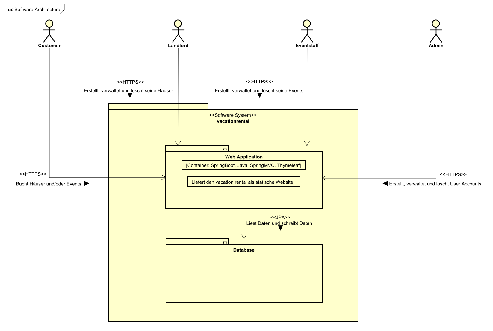
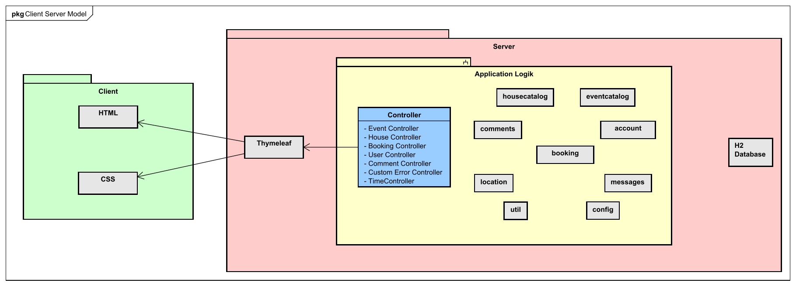
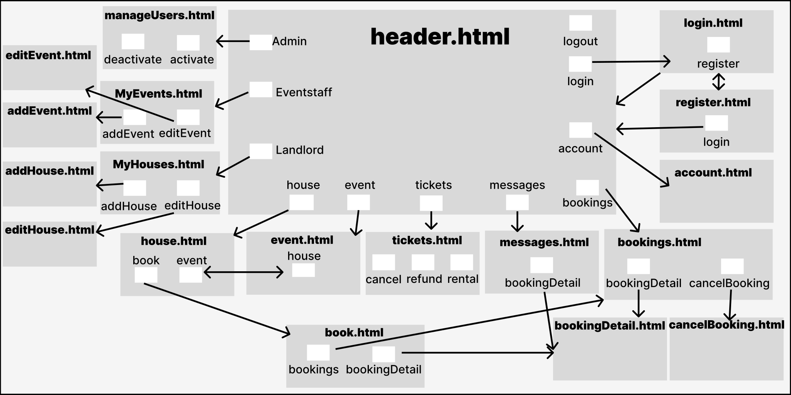
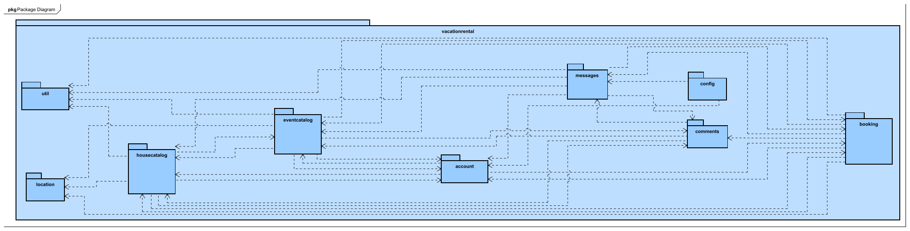
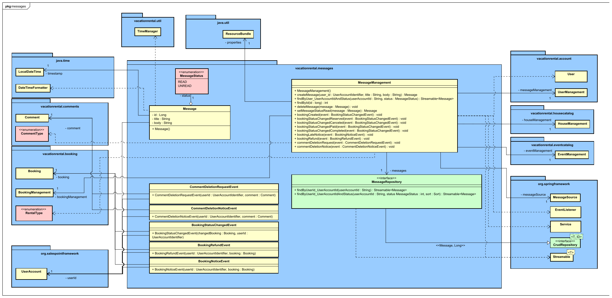
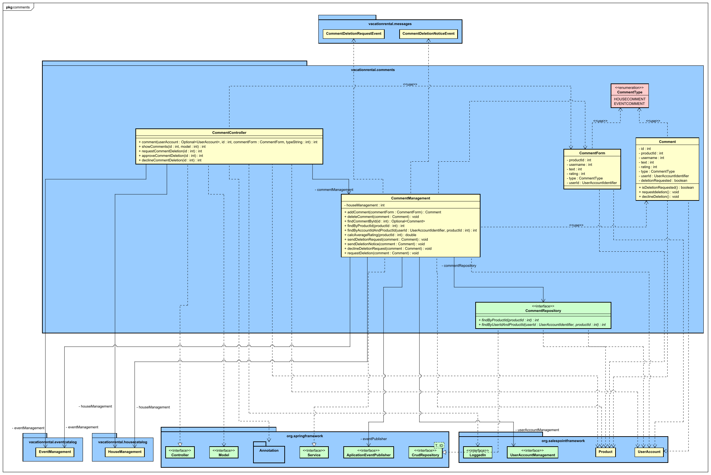
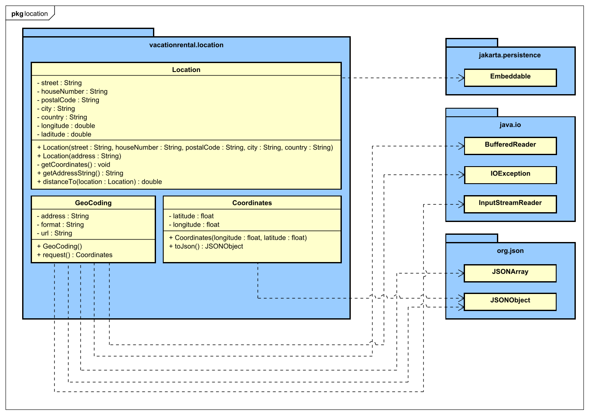
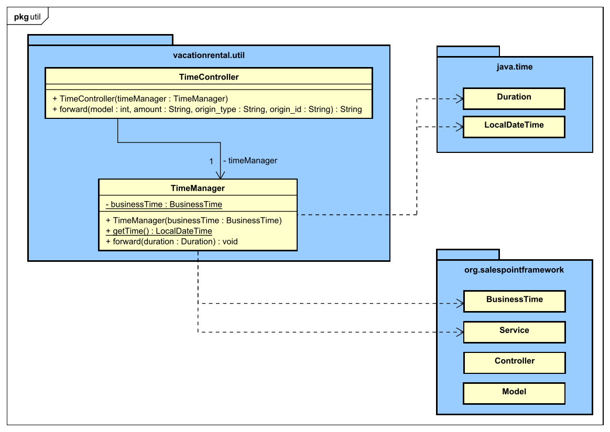
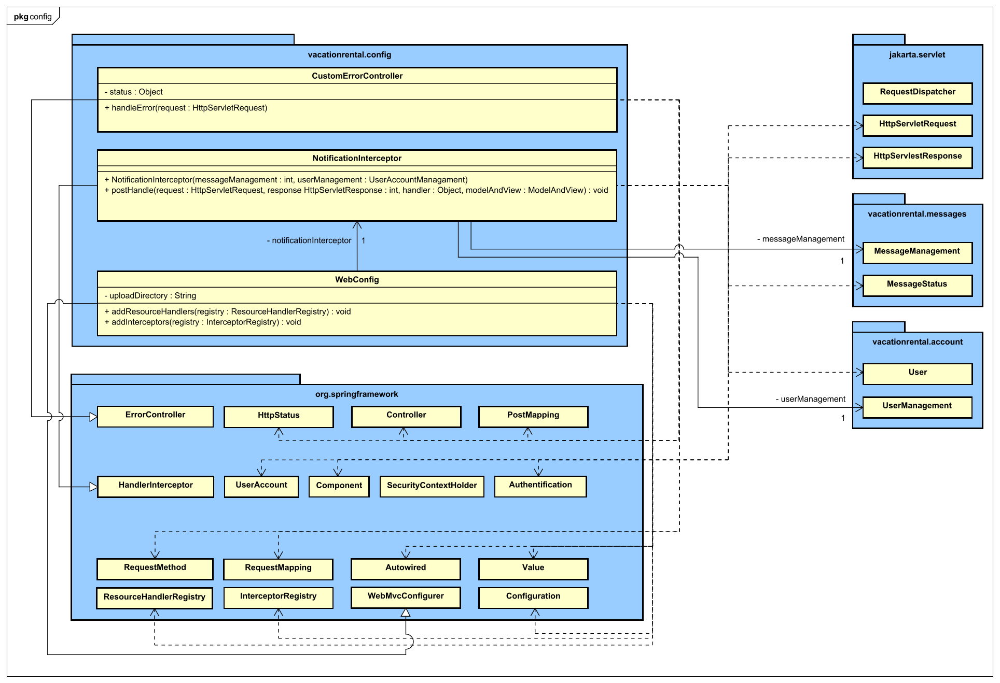
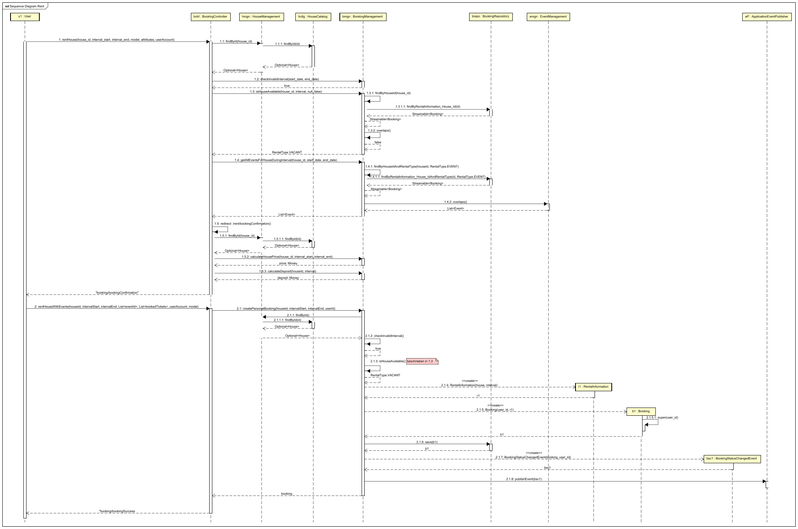

= Entwicklerdokumentation
:project_name: developer_documentation_vacationrental
:toc: left
:numbered:

[options="header"]
[cols="1, 3, 3"]
|===
|Version | Bearbeitungsdatum   | Autor
|0.1    | 15.11.2024 a| Anthony Lanzenberger, Christoph Tischer, Erik Schneider, Francis Lweya, Robert Bing, Robert Tschorn, Sokar Abdulkhalaq, Tevin Meißner
|0.2    | 13.11. - 17.11.2024 a| Anthony Lanzenberger, Christoph Tischer, Erik Schneider, Francis Lweya, Robert Bing, Robert Tschorn, Sokar Abdulkhalaq, Tevin Meißner
|===

== Einführung

Ziel dieses Projektes ist die Entwicklung eines professionellen Online-Portals für die Verwaltung und Vermietung von Ferienwohnungen in Dresden und Umgebung.
Die Benutzer können in den Angeboten stöbern und nach einer Registrierung ein Haus für den gewünschten Zeitraum mieten.
Jedes Angebot enthält wichtige Details wie Lage, Kurzbeschreibung, Bilder und Informationen über den Vermieter.
Die Benutzer können ein Objekt reservieren oder buchen, solange es in dem von ihnen gewünschten Zeitraum verfügbar ist, wobei die Vermieter eine Mindest- und Höchstmietdauer festlegen können.

Reservierungen können nur für Termine vorgenommen werden, die mehr als einen Monat in der Zukunft liegen; ansonsten ist eine direkte Buchung erforderlich.
Zur Sicherung der Reservierung ist innerhalb von sieben Werktagen nach der Buchungsbestätigung eine Anzahlung von 10 % des Gesamtmietpreises zu leisten.
Wenn die Anzahlung nicht innerhalb dieses Zeitraums eingeht, wird die Reservierung für andere Benutzer freigegeben.
Darüber hinaus können die Benutzer ihre Buchungen innerhalb einer bestimmten Frist vor dem Check-in gebührenfrei stornieren; Stornierungen nach dieser Frist führen jedoch zum Verlust der Anzahlung.

Vermieter müssen sich für den Zugang zur Plattform die Genehmigung eines Administrators einholen, da eine Selbstregistrierung nicht möglich ist.
Sobald sie sich angemeldet haben, haben Vermieter die volle Autorität über ihre Inserate und können Objekte hinzufügen, bearbeiten und löschen.
Außerdem haben sie Zugang zu ausführlichen Immobilienberichten, die den Mietverlauf, aktuelle Buchungen, Reservierungen und Ereignisse im Zusammenhang mit jeder Immobilie enthalten.
Vermieter können Buchungen bestätigen oder ablehnen, auf Buchungsanfragen antworten, Veranstaltungen verwalten und Immobiliendetails aktualisieren.
Für den Fall, dass eine bestätigte Buchung storniert werden muss, gibt es besondere Vorkehrungen.

Das Portal arbeitet mit einem lokalen Eventmanagement-Unternehmen zusammen, um Veranstaltungen zu unterstützen, die das Urlaubserlebnis bereichern.
Veranstaltungskoordinatoren (Eventmitarbeiter) sind befugt, Veranstaltungen zu erstellen, zu ändern und zu verwalten, die in zwei Haupttypen eingeteilt werden: große, einmalige Veranstaltungen, für die eine gesonderte Reservierung erforderlich ist, und wöchentlich wiederkehrende Veranstaltungen, an denen man kostenlos teilnehmen kann.

Großveranstaltungen sind aufgrund ihrer Nähe zum Veranstaltungsort an bestimmte Immobilien gebunden und müssen zum Zeitpunkt der Immobilienbuchung mitgebucht werden.
Wird eine Großveranstaltung abgesagt, erhalten die Benutzer, die sie gebucht haben, eine Rückerstattung.
Bevor Veranstaltungen von Nutzern eingesehen werden können, müssen sie von den Vermietern der zugehörigen Immobilien genehmigt werden.
Kleinere, wiederkehrende Veranstaltungen bedürfen ebenfalls der Genehmigung des Vermieters, werden aber als Teil der Reiseroute den Benutzern vorgeschlagen und können nicht reserviert werden.

Die Plattform verfügt über eine Administratorrolle, die für die Verwaltung der Benutzerkonten zuständig ist und sowohl die Erstellung als auch die Löschung von Konten für Urlauber, Vermieter und Veranstaltungskoordinatoren (Eventmitarbeitern) übernimmt.
Diese Rolle ist wichtig, um die Sicherheit der Konten zu gewährleisten, den Benutzerzugang zu regeln und die allgemeine Integrität des Systems zu bewahren.

== Randbedingungen

=== Hardware-Vorgaben

* Linux Server (Unternehmen)
* Computer mit Internet Anbindung (Endnutzer)
* Tastatur (Endnutzer)
* Maus (Endnutzer)

=== Software-Vorgaben

Die folgende oder eine neuere Java Version ist nötig:

* Java 21

Die folgenden oder neueren Browser Versionen sind nötig:

* Firefox 130.0.0
* Google Chrome 131.0.0
* Chromium based browsers 130.0.0
* Opera 114.0.0
* Safari 18.0

=== Vorgaben zum Betrieb der Software

Das System wird von ElbtalGenuss als Web Shop benutzt, um Häuser zu vermieten un die Teilnahme an Events zu vermitteln.

Die Software soll auf einem Server laufen und über das Internet mit einem Browser 24/7 für Kunden erreichbar sein.

Die Nutzer sind Internetnutzende Kunden, welche normalerweise die Navigation auf einer Webseite beherrschen, sowie Vermieter, Eventmitarbeiter und Admins welche nicht unbedingt technisches Wissen besitzen.

Das System soll möglichst geringe Wartungsarbeiten benötigen.

Alle Daten sollen in einer Datenbank gespeichert werden und über die Applikation aufrufbar sein (somit ist kein Vorwissen über Datenbanken benötigt).

== Kontextabgrenzung

[[context_diagram]]
image::./models/design/ContextDiagramm.svg[title= "Kontextdiagramm"]

== Lösungsstrategie

[cols="2,3",options="header"]
|===
| Qualitätsanforderung | Lösungsansatz

| Wartbarkeit
a| - *Modularität*: Die Anwendung in einzelne Komponenten unterteilen, sodass Änderungen an einer Komponente weniger Einfluss auf andere Komponenten haben.
- *Wiederverwendbarkeit*: Sicherstellen, dass die Komponenten des Systems von anderen Komponenten oder Systemen wiederverwendet werden können.
- *Modifizierbarkeit*: Sicherstellen, dass die Anwendung ohne Einführung von Fehlern oder Verschlechterung der Produktqualität verändert oder erweitert werden kann.

| Benutzbarkeit
a| - *Erlernbarkeit*: Sicherstellen, dass das System von seinen Benutzern leicht verstanden und bedient werden kann. Dies kann z.B. durch eindeutige Beschreibung der Eingaben mit Labels oder Tooltips realisiert werden.
- *Benutzerfehlerschutz / Fehlerbehandlung*: Den Benutzer vor Fehlern schützen. Ungültige Eingaben dürfen nicht zu ungültigen Systemzuständen führen.
- *Ästhetik der Benutzeroberfläche*: Eine angenehme und zufriedenstellende Interaktion für den Benutzer bereitstellen.
- *Barrierefreiheit*: Sicherstellen, dass Benutzer mit unterschiedlichen begebenheiten das System vollständig nutzen können. Dies kann z.B. durch geeignete Schriftgrößen und Farbkontraste realisiert werden.

| Sicherheit
a| - *Vertraulichkeit*: Sicherstellen, dass Daten nur von autorisierten Personen eingesehen werden können. Dies kann mit *Spring Security* und *Thymeleaf* (`sec:authorize-Tag`) realisiert werden.
- *Integrität*: Verhindern der unbefugten Datenänderung. Dies kann mit *Spring Security* (@PreAuthorize-Annotation) realisiert werden.
- *Nachvollziehbarkeit*: Die Rückverfolgbarkeit von Aktionen oder Ereignissen zu einer eindeutigen Entität oder Person. Für diese Anwendung sollte jede *Bestellung* einem *Kunden* zugeordnet sein.
|===

=== Softwarearchitektur Beschreibung der Softwarearchitektur

[[container_model]]

[[client_server_diagram]]

*Erklärung:* HTML-Vorlagen werden auf dem Server gerendert und vom Client (User) mit den entsprechenden CSS-Stilvorlagen angezeigt.
Die Daten, welche in den Vorlagen gezeigt werden, sind von Thymeleaf bereitgestellt.
Thymeleaf erhält die angeforderten Daten von den jeweiligen Controllerklassen, welche im Backend implementiert sind.
Die Controller Klassen hingegen benutzen Instanzen und Methoden von den Modelklassen.
Eine H2 Datenbank speichert alle Daten permanent.

=== Entwurfsentscheidungen

==== Verwendete Muster

* Spring MVC

==== Persistenz

Die Anwendung nutzt *Hibernate*-Annotationen-basierte Abbildung, um Java-Klassen auf Datenbanktabellen abzubilden.
Als Datenbank wird *H2* eingesetzt.
Die Persistenz ist standardmäßig deaktiviert.
Um die persistente Speicherung zu aktivieren, müssen die folgenden zwei Zeilen in der Datei application.properties auskommentiert werden:

....
# spring.datasource.url=jdbc:h2:./db/vacationrental
# spring.jpa.hibernate.ddl-auto=update
....

==== Benutzeroberfläche

[[user-interface]]

NOTE: Die grauen Boxen repräsentieren HTML Seiten.
Die weißen Boxen repräsentieren Buttons, die zu den jeweiligen Seiten führen.

=== Verwendung externer Frameworks

[options="header",cols="1,2,3"]
|===
|Externes Package|Verwendet von|Warum
|Spring Boot| Backend Server und Thymeleaf |Vereinfacht die Einrichtung und Entwicklung einer Java-basierten Anwendung durch die Bereitstellung vorkonfigurierter Frameworks, wodurch sich die Anzahl der Codebausteine verringert
|Spring Data JPA|Persistierung| Abstrahiert die zugrunde liegende Datenbanktechnologie und macht Ihre Anwendung flexibler und portabel

|===

== Bausteinsicht

*Package Diagramm*

*Entwurfsklassendiagramme der einzelnen Packages* +

*Booking*

image::./models/design/BookingDiagram.svg[ 100%,100%,pdfwidth=100%,title= "Entwurfsdiagramm Booking Subsystem",align=center]

*House*

image::./models/design/HouseDiagram.svg[100%,100%,pdfwidth=100%,title= "Entwurfsdiagramm House Subsystem",align=center]

*Event*

image::./models/design/EventDiagram.svg[100%,100%,pdfwidth=100%,title= "Entwurfsdiagramm Event Subsystem",align=center]

*Account*

image::./models/design/AccountDiagram.svg[100%,100%,pdfwidth=100%,title= "Entwurfsdiagramm Account Subsystem",align=center]

*Messages*

*Comments*

*Location*

*Util*

*Config*

[options="header"]
|===
|Klasse/Enumeration |Beschreibung

|House            a|    - `vacationrental.housecatalog.House`
- Erweitert `salespointframework.Product`
- Repräsentiert die Haus-Klasse, mit Annotation `@Entity`

|HouseManagement    a|    - `vacationrental.housecatalog.HouseManagement`
- Schnittstelle für Verwaltungsfunktionen von Häusern

|HouseCatalog        a|    - `vacationrental.housecatalog.HouseCatalog`
- Basierend auf `salespointframework.catalog`
- Erweitert `Catalog<House>` und ist eine Schnittstelle
- Zuständig für das Sammeln und Sortieren von Häusern

|HouseController    a|    - `vacationrental.housecatalog.HouseController`
- Mit Annotation `@Controller`, `springframework.stereotype.Controller`
- Verbindet die Website mit der Backend-Logik

|HouseInitializer    a|    - `vacationrental.housecatalog.HouseInitializer`
- Basierend auf `salespointframework.core.DataInitializer`
- Mit Annotation `@Component`, implementiert `DataInitializer`
- Erstellt Standard-Häuser zur Initialisierung des Katalogs

|HouseForm        a|    - `vacationrental.housecatalog.HouseForm`
- Datensammlung zur detaillierten Beschreibung eines Hauses

|Booking a| - `vacationrental.booking.Booking`
- Erweitert `salespointframework.Order`
- Repräsentiert einen Buchungsvorgang und den aktuellen Zustand der Buchung

|RentalInformation a| - `vacationrental.booking.RentalInformation`
- Repräsentiert allgemeine Informationen über eine Buchung, hält eine Referenz auf `Booking`
- Annotation `@Entity`, `javax.persistence.Entity`

|RentalType a| - `vacationrental.booking.RentalType`
- Enumeration, die die Art der Buchung definiert (für ein Event oder eine private Buchung)

|BookingStatus a| - `vacationrental.booking.BookingStatus`
- Enumeration, die den Status einer Buchung definiert (z.B. reserviert, Anzahlung geleistet, storniert, ...)

|BookingManagement a| - `vacationrental.booking.BookingManagement`
- Schnittstelle zur Verwaltung von Buchungen
- Annotation `@Component`, `springframework.stereotype.Component`

|BookingController a| - `vacationrental.booking.BookingController`
- Mit Annotation `@Controller`, `springframework.stereotype.Controller`
- Verbindet die Website mit der Backend-Logik

|BookingRepository a| - `vacationrental.booking.BookingRepository`
- Interface welches `CrudRepository` erweitert
- Schnittstelle zur Datenbankanbindung für Buchungen

|RentalDataInitializer a| - `vacationrental.booking.RentalDataInitializer`
- Basierend auf `salespointframework.core.DataInitializer`
- Mit Annotation `@Component`, implementiert `DataInitializer`
- Erstellt Standard-Buchungen zur Initialisierung des Katalogs

|Event		            a| 	- `vacationrental.eventcatalog.Event`
                            - Erweitert `salespointframework.Product`
			                - Repräsentiert die Event-Klasse
							- Annotation `@Entity`, `javax.persistence.Entity`
|RecurrencePattern	    a| 	- `vacationrental.eventcatalog.RecurrencePattern`
                            - Enum zur Repräsentation der Wiederholungsabstände
|EventType	            a| 	- `vacationrental.eventcatalog.EventType`
                            - Enum zur Repräsentation von BIG_EVENT und SMALL_EVENT
|EventManagement	    a| 	- `vacationrental.eventcatalog.EventManagement`
			                - Schnittstelle für Verwaltungsfunktionen von Events
							- Annotation `@Service`, `org.springframework.stereotype.Service`
|EventCatalog		    a| 	- `vacationrental.eventcatalog.EventCatalog`
			                - Basierend auf `salespointframework.catalog`
				            - Erweitert `Catalog<Event>` und ist eine Schnittstelle
				            - Zuständig für das Sammeln und Sortieren von Events
|EventController	    a| 	- `vacationrental.eventcatalog.EventController`
			                - Verbindet die Website mit der Backend-Logik
							- Annotation `@Controller`, `springframework.stereotype.Controller`
|EventInitializer	    a| 	- `vacationrental.eventcatalog.EventInitializer`
			    		    - Basierend auf `salespointframework.core.DataInitializer`
				            - Annotation `@Component`, implementiert `DataInitializer`
				            - Erstellt Standard-Events zur Initialisierung des Katalogs
|EventForm	        a| 	- `vacationrental.eventcatalog.EventForm`
			                - Datensammlung zur detaillierten Beschreibung eines großen oder kleinen Events

|User a| - `vacationrental.account.User`
- Erweitert `salespointframework.UserAccount`
- Repräsentiert die User-Klasse, mit Annotation `@Entity`
|RegistrationForm a| - `vacationrental.account.RegistrationForm`
- Datensammlung zur detaillierten Beschreibung eines Users
|UserManagement a| - `vacationrental.account.UserManagement`
- Schnittstelle für Verwaltungsfunktionen von Usern
- Annotation `@Service`, `org.springframework.stereotype.Service`
|UserController a| - `vacationrental.account.UserController`
- Mit Annotation `@Controller`, `springframework.stereotype.Controller`
- Verbindet die Website mit der Backend-Logik
|UserRepository a| - `vacationrental.account.UserRepository`
- Interface, welches `CrudRepository` erweitert
- Schnittstelle zur Datenbankanbindung für Benutzer
|UserDataInitializer a| - `vacationrental.account.UserDataInitializer`
- Basierend auf `salespointframework.core.DataInitializer`
- Mit Annotation `@Component`, implementiert `DataInitializer`
- Erstellt Standard-Benutzer zur Initialisierung des Katalogs

|Comment            a|    - `vacationrental.comments.Comment`
- genau einem Objekt und User zugeordnet
- repräsentiert Kommentare für Events und Häuser, mit Annotation `@Entity`

|CommentController            a|    - `vacationrental.comments.CommentController`
- Mit Annotation `@Controller`, `springframework.stereotype.Controller`
- Verbindet die Website mit der Backend-Logik
- ermöglicht das erstellen, löschen und verwalten von Kommentaren

|CommentForm            a|    - `vacationrental.comments.CommentForm`
- dient dem sammeln von Daten für einen bestimmten Kommentar in einer Klasse
- wird bei der Erstellung von Kommentaren ausgefüllt

|CommentManagement            a|    - `vacationrental.comments.CommentManagement`
- Annotation `@Service`, `org.springframework.stereotype.Service`
- stellt die Schnittstelle zwischen allen Funktionen des comment packages dar

|CommentRepository            a|    - `vacationrental.comments.CommentRepository`
- Interface, welches `CrudRepository` erweitert
- Schnittstelle zur Datenbank, in welcher alle Kommentare gespeichert werden

|CommentType            a|    - `vacationrental.comments.CommentType`
- Enum zur unterscheidung zwischen HOUSECOMMENT und EVENTCOMMENT
- unterscheidet zwischen Kommentaren für Häuser oder für Events

|BookingNoticeEvent            a|    - `vacationrental.messages.BookingNoticeEvent`
- Event welches dem Nutzer eine Nachricht sendet, dass die Buchung zu spät ist
- wird vom Landlord ausgelöst

|BookingRefundEvent            a|    - `vacationrental.messages.BookingRefundEvent`
- Event welches dem Nutzer eine Nachricht sendet, wenn es eine Rückerstattung gibt

|BookingStatusChangedEvent            a|    - `vacationrental.messages.BookingStatusChangedEvent`
- Event welches Nachrichten sendet, wenn sich der Status einer Buchung ändert

|CommentDeletionNotice           a|    - `vacationrental.messages.CommentDeletionNotice`
- Event welches eine Nachricht sendet, wenn ein Kommentar gelöscht wird

|CommentDeletionRequest           a|    - `vacationrental.messages.CommentDeletionRequest`
- Event welches eine Nachricht sendet, wenn der Landlord die Löschung eines Kommentars beantragt

|Message            a|    - `vacationrental.messages.Message`
- Annotation `@Entity`
- Repräsentiert eine Nachricht, mit Überschrift und Text, welche an einen User gesendet wird

|MessageManagement            a|    - `vacationrental.messages.MessageManagement`
- Annotation `@Service`
- Schnittstelle für Verwaltungsfunktionen von Nachrichten, erstellt die genaue Nachricht und speichert sie.

|MessageRepository            a|    - `vacationrental.messages.MessageRepository`
- Interface, welches `CrudRepository` erweitert
- Speichert alle Nachrichten in der Datenbank

|MessageStatus            a|    - `vacationrental.messages.MessageStatus`
- Enum zur Unterscheidung zwischen gelesenen und ungelesenen Nachrichten
|CustomErrorController a| - `vacationrental.config.CustomeErrorController`
- Annotation `@Controller`
- fängt Fehlermeldungen ab und leitet auf eigene Fehlerseiten weiter
|NotificationInterceptor a| - `vacationrental.config.NotificationInterceptor`
- Annotation `@Component`
- erfüllt `postHandle`-Methode, um als letzten Schritt die Anzahl der ungelesenen Nachrichten anzuzeigen
|WebConfig a| - `vacationrental.config.WebConfig`
- Annotation `@Configuration`
- registiert Upload-Verzeichnis bei Programmstart und fügt NotificationInterceptor hinzu
|Location a| - `vacationrental.location.Location`
- Annotation @Embeddable`
- Repräsentiert eine vollständige Adresse inklusive Koordinaten
- verfügt über Methode zum Erhalt eines Links für eine OSM-Url
|GeoCoding a| - `vacationrental.location.GeoCoding`
- führt Geocoding durch, um Koordinaten für eine Adresse zu erhalten
|Coordinates a| - `vacationrental.location.Coordinates`
- Repräsentiert Koordinaten, wird für GeoCoding benötigt aber später nicht weiterverwendet
|TimeManager a| - `vacationrental.util.TimeManager`
- Annotation `@Service`
- verwaltet `salespointframework.time.BusinessTime`
|TimeController a| - `vacationrental.util.TimeController`
- Annotation `@Controller`
- leitet Eingaben für Zeitänderungen an `TimeManager` weiter
|===

=== Rückverfolgbarkeit zwischen Analyse- und Entwurfsmodell

_Die folgende Tabelle zeigt die Rückverfolgbarkeit zwischen Entwurfs- und Analysemodell._

[options="header"]
|===
|Klasse/Enumeration (Analysemodell) | Klasse/Enumeration (Entwurfsmodell)

|House            a|    - `vacationrental.housecatalog.House`
- Implementiert basierend auf `salespointframework.Product`

|manages (HouseManagement)    a|    - `vacationrental.housecatalog.HouseManagement`
- Schnittstelle zur Verwaltung von Häusern

|RentalCatalog (HouseCatalog)    a|    - `vacationrental.housecatalog.HouseCatalog`
- Implementiert basierend auf `salespointframework.catalog`

|Location        a|    - `vacationrental.util.Location`
- Repräsentiert eine Adresse

|Booking    a| - `vacationrental.booking.Booking`
- Repräsentiert einen Buchungsvorgang und den aktuellen Zustand der Buchung
- basiert auf `salespointframework.Order`

|RentalInformation a| - `vacationrental.booking.RentalInformation`
- Repräsentiert allgemeine Informationen über eine Buchung, hält eine Referenz auf `Booking`

|Type a| - `vacationrental.booking.RentalType`
- Enumeration, die die Art der Buchung definiert (für ein Event oder eine private Buchung)

|Status a| - `vacationrental.booking.BookingStatus`
- Enumeration, die den Status einer Buchung definiert (z.B. reserviert, Anzahlung geleistet, storniert, ...)
- erweitert `salespointframework.OrderStatus`

|Event  a|   - `vacationrental.eventcatalog.Event`
            - Implementiert basierend auf `salespointframework.Product`

|BigEvent a|   - `vacationrental.eventcatalog.EventType.BIG_EVENT`
            - Enum benutzt von `vacationrental.eventcatalog.Event`

|SmallEvent a|   - `vacationrental.eventcatalog.EventType.SMALL_EVENT`
            - Enum benutzt von `vacationrental.eventcatalog.Event`

|EventCatalog a|   - `vacationrental.eventcatalog.EventCatalog`
            - Implementiert basierend auf `salespointframework.catalog`

|manages (EventManagement) a|   - `vacationrental.eventcatalog.EventManagement`
            - Implementiert basierend auf `salespointframework.Product`
            - Schnittstelle zur Verwaltung von Events

|signs up (EventManagement) a|   - `vacationrental.eventcatalog.EventManagement`
            - Implementiert basierend auf `salespointframework.Product`
            - Kunden können über eine EventManagement Methode `vacationrental.eventcatalog.EventManagement.bookEventTicket()` Event Tickets kaufen
|User a| - `vacationrental.account.User`
- Erweitert `salespointframework.UserAccount`
- Repräsentiert einen allgemeinen Benutzer des Systems, abstrahiert spezifische Benutzerrollen
|RegisteredUser a| - `vacationrental.account.RegisteredUser`
- Abstrakte Klasse, erweitert `User`
- Basisklasse für spezifische Benutzerrollen wie Customer, EventStaff, Admin, und Landlord
|Customer a| - `vacationrental.account.Customer`
- Erweitert `vacationrental.account.RegisteredUser`
- Repräsentiert einen Benutzer, der Häuser oder Events bucht
- Buchung durchführen mit `vacationrental.booking.Booking.createBooking()`
|EventStaff a| - `vacationrental.account.EventStaff`
- Erweitert `vacationrental.account.RegisteredUser`
- Verantwortlich für die Verwaltung von Events
|Admin a| - `vacationrental.account.Admin`
- Erweitert `vacationrental.account.RegisteredUser`
- Verfügt über Systemverwaltungsrechte, einschließlich der Benutzerverwaltung und Genehmigung von Buchungen
|Landlord a| - `vacationrental.account.Landlord`
- Erweitert `vacationrental.account.RegisteredUser`
- Verantwortlich für das Hinzufügen, Verwalten und Genehmigen von Häusern im RentalCatalog
-Genehmigt eine Buchung für eines seiner Häuser mit `vacationrental.housecatalog.HouseManagement.approveBooking()`

|===

== Laufzeitsicht

Das Sequenzdiagramm zeigt die Interaktion zwischen dem Benutzer (Customer) und dem System.
Der Benutzer navigiert in die Hausübersicht, wählt ein Haus und führt eine Reservierung durch.
Das System überprüft die Verfügbarkeit des Hauses und bestätigt die Reservierung.

