:project_name: Ferienhausverwaltung
:toc: left
:numbered:
= Pflichtenheft __{project_name}__

[options="header"]
[cols="1, 1, 1, 4, 2"]
|===
|Version | Status      | Bearbeitungsdatum   | Autoren(en) |  Vermerk
|0.1     | In Arbeit   | 21.10.2024          | Anthony Lanzenberger, Christoph Tischer, Erik Schneider, Francis Lweya, Robert Bing, Robert Tschorn, Sokar Abdulkhalaq, Tevin Meißner
| Initiale Version
|===

== Zusammenfassung
Dieses Dokument stellt die Software-Anforderungsspezifikation für das Projekt Ferienhausverwaltung dar. Es soll einen Überblick über das zu erstellende Softwareprodukt geben und dient als Grundlage für die Kommunikation zwischen dem Auftraggeber und dem Entwicklungsteam. Dieses Dokument dient auch als Grundlage für einen Vertrag zwischen dem Auftraggeber und dem Auftragnehmer, dessen Anforderungen von den Entwicklern erfüllt werden müssen. Es werden die Details, die spezifischen Funktionen und die Anforderungen, die implementiert werden sollen, geklärt.

Zusammenfassend lässt sich sagen, dass das SRS bei diesem Projekt dazu dient, die Funktionalität der Software zu erläutern und zu bewerten, ob die Software den geplanten Spezifikationen entspricht. Alle Anmerkungen und Änderungen werden in dieser SRS dokumentiert.

== Aufgabenstellung und Zielsetzung
Das Unternehmen "Elbtal-Genuss" hat sich auf die Vermittlung von Ferienhäusern in und um
Dresden spezialisiert. Die Geschäftsführerin Frau Dr. Elbe hat sich dazu entschlossen, eine
Webapplikation für die Verwaltung der Ferienhäuser zu entwickeln. +

Es soll die Möglichkeit geboten werden, sich Ferienhäuser anzuschauen und nach erfolgreicherer
Registrierung für einen bestimmten Zeitraum zu mieten. Das Haus wird dabei durch den Ort, eine
Beschreibung, ein paar Bilder und dem Vermieter repräsentiert. Benutzer können dabei das Haus für
einen bestimmten Zeitraum für sich reservieren oder buchen, sofern dieses noch zur gewünschten
Zeit frei ist. Bei einer Buchung fällt eine Anzahlung an, die sich auf ca. 10 % der Gesamtkosten des
Urlaubs beläuft. Diese muss er dem Vermieter fristgerecht überweisen, welcher danach die Buchung
bestätigt. Ansonsten verfällt die Reservierung und wird wieder frei. Weiterhin ist vorgesehen, dass
der einmal gebuchte Urlaub storniert werden kann. Bis zu einer gewissen Frist, einige Tage vor
Urlaubsbeginn, soll das kostenfrei sein, während nach Ablauf dieser Frist die Anzahlung vom
Vermieter einbehalten werden kann. +

Wenn sich der Vermieter eines Ferienhauses beim Portal registrieren möchte, wird dies durch einen
Administrator vorgenommen. Nach erfolgreichem Freischalten eines Vermieters hat dieser folgende
Möglichkeiten auf der Platform:

** neue Häuser im System eintragen
** bestehende Häuser ändern
** Häuser löschen
** Übersichten über die Häuser:
* frühere Mieten - wer, wann, wie lange in dem Haus gelebt hat
* aktuelle Buchungen und Reservierungen
* Liste von Events +

Der Vermieter hat somit die Möglichkeiten Buchungen und Reservierungen zu bestätigen oder zu
verwerfen, wobei darauf zu achten ist, was passiert, wenn eine schon bezahlte Buchung rückgängig
gemacht werden muss, Events zu bestätigen oder zu löschen und die Hausdetails zu verändern. +

Weiterhin soll das Portal mit einer Eventfirma zusammenarbeiten, die sich ebenfalls in und um
Dresden engagiert. Eventmitarbeiter haben daher ebenfalls einen Zugang zu dem System. Diese
können nach dem erfolgreichen Einloggen Events erstellen, verändern oder löschen. Dabei
unterscheidet man zwischen großen einmaligen Events, für die eine Reservierung nötig ist, und
kleineren wöchentlich stattfindenden Events, die kostenfrei besucht werden können. Größere Events
müssen beim Buchen des Urlaubes zusätzlich gebucht werden, was es nötig macht, dass diese
Events an ein Haus oder mehrere Häuser gebunden sind. Es kommen nur jene Häuser infrage, die
relativ nah zu dem Veranstaltungsort des Events sind. +

Ein Event wird durch den Namen, den Ort, die Zeit in der es stattfindet und den Preis (ggf.
kostenlos) beschrieben. Wenn ein größeres Event abgebrochen wird, müssen den Urlaubern, die das
Event gebucht haben, auch ihre Kosten rückerstattet werden. Bevor Events an Häuser gebunden
werden und somit für die Benutzer sichtbar und buchbar werden, muss das vom jeweiligen
Vermieter bestätigt werden. Kleinere Events bedürfen auch einer Bestätigung, müssen aber nicht
gebucht werden und dienen somit den Benutzern lediglich als Hinweis, wie sie ihren Urlaub
verleben können. +

Als Letztes wird ein Zugang für den Administrator gebraucht, der das System verwalten soll. Im
Wesentlichen bezieht sich das auf die Verwaltung von Mitgliedern, das Löschen und Freischalten
von Urlauberkonten und dem Erstellen und Löschen von Vermieter- und Eventmitgliederkonten. +

== Produktnutzung

Das Ferienhaus-Verwaltungsportal dient zur zentralen Verwaltung, Vermietung und Buchung
von Ferienhäusern und Events in Dresden und Umgebung. Urlauber können sich registrieren, um Ferienhäuser
zu reservieren und zu buchen. Vermieter, die durch einen Administrator erstellt und freigeschaltet werden müssen,
verwalten ihre Ferienhäuser eigenständig. Eventmitarbeiter haben die Möglichkeit,
lokale Events zu erstellen, zu verändern oder zu löschen. Diese Veranstaltungen können
optional von Urlaubern dazugebucht werden.

Die Software wird als Webanwendung betrieben und steht rund um die Uhr über das Internet zur Verfügung.
Sie soll auf gängigen Browsern zugänglich und für eine optimierte Darstellung auf aktuellen Versionen
ausgelegt sein:

- Mozilla Firefox, Version 132.0+
- Google Chrome, Version 130.0.6723.70+

== Interessensgruppen (Stakeholders)
Welche realen und juristischen Personen(-gruppen) haben Einfluss auf die Anforderungen im Projekt? +

Die Priorisierung erfolgt auf einer Skala von 1 (geringe Relevanz) bis 5 (hohe Relevanz).

[options="header", cols="2, ^1, 4, 4"]
|===
|Name
|Priorität (1..5)
|Beschreibung
|Ziele/ Interessen

|Unternehmen "Elbtal-Genuss"
|5
|Auftraggeber des Projektes.
a|
- Sicherstellung eines reibungslosen Betriebs und hoher Kundenzufriedenheit
- Erhöhung der Buchungszahlen

|Vermieter (Lokale Anbieter aus Dresden und Umgebung)
|5
|Stellen Ferienhäuser zur Vermietung auf der Plattform zur Verfügung.
a|
- Effiziente Verwaltung ihrer Ferienhäuser

|Benutzer (Touristen/ Urlauber)
|5
|Nutzen die Webanwendung um Ferienhäuser und Events zu buchen.
a|
- Einfache Buchung und Verwaltung dieser Buchungen

|Eventunternehmen (Eventmitarbeiter)
|3
|Erstellen und verwalten optionale Events.
a|
- zusätzliches Angebot für die Benutzer
- Einfache Eventverwaltung
- Erhöhte Buchungen der Events

|Administrator
|2
|Verwaltet die gesamte Plattform.
a|
- Effiziente Verwaltung der verschiedenen Konten
- Sicherstellung eines reibungslosen Betriebs

|Entwickler
|3
|Zuständig für die Implementierung, Wartung und Weiterentwicklung der Webanwendung.
a|
- Hohe Stabilität und Benutzerfreundlichkeit des Systems

|===

== Systemgrenze und Top-Level-Architektur

=== Kontextdiagramm
Das Kontextdiagramm zeigt das geplante Software-System in seiner Umgebung. Zur Umgebung gehören alle Nutzergruppen des Systems und Nachbarsysteme.

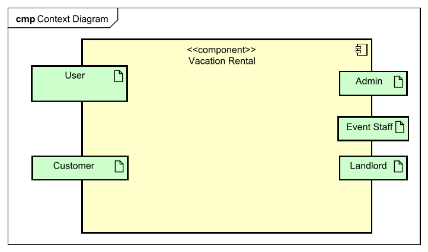

=== Top-Level-Architektur
Das Komponentenmodell (Top-Level-Architektur) zeigt das geplante Software-System mit seinen verschiedenen Subsystemen und welche Nutzergruppen mit den verschiedenen Bereichen interagieren.

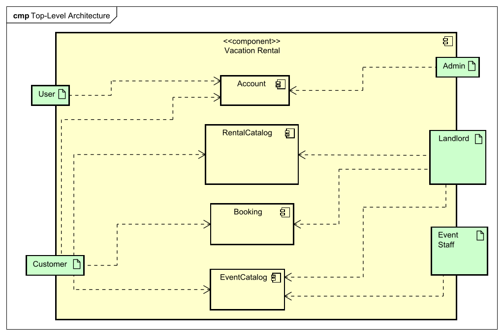

== Anwendungsfälle

=== Akteure

Akteure sind die Benutzer des Software-Systems oder Nachbarsysteme, welche darauf zugreifen.

[cols="2" options="header"]
[%autowidth]
|===
|Name|Beschreibung
|User|Jeder Besucher der Webseite hat Grundlegend diese Rolle, welche es ermöglicht, die uneingeschränkten Funktionalitäten zu verwenden.
|Registered User|Ein Benutzer mit einem freigeschalteten Konto.
|Customer|Kunden sind die Benutzer, welche sich Häuser mieten und Eventtickets kaufen.
|Landlord|Vermieter sind Benutzer, welche Häuser vermieten, verwalten und für Events freigeben.
|EventStaff|Eventmitarbeiter sind Benutzer, welche Events erstellen und verwalten.
|Admin|Administratoren sind Benutzer, welche Konten erstellen, freischalten und löschen können
|===

=== Überblick Anwendungsfalldiagramm

Anwendungsfall-Diagramm, das alle Anwendungsfälle und alle Akteure darstellt.

[[use_case_diagram]]
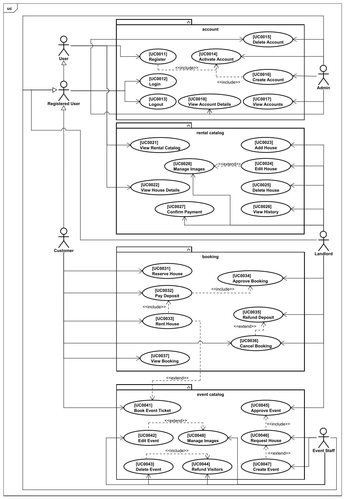

=== Anwendungsfallbeschreibungen

Dieser Unterabschnitt beschreibt die Anwendungsfälle.

NOTE: Es wurde nicht für jeden der Anwendungsfälle ein Sequenzdiagramm erstellt, sondern lediglich für einzelne, komplexe Anwendungsfälle.

[cols="1h, 3"]
[[UC0011]]
[%autowidth]
|===
|ID|**<<UC0011>>**
|Name|Register
|Akteur(e)|User
|Beschreibung|Ein nicht-registrierter Benutzer legt sich ein Konto an.
|Vorbedingungen|Der Benutzer ist aktuell nicht angemeldet.
|Auslöser|Der Benutzer möchte sich ein Konto anmelden.
|Notwendige Schritte a|
- Der Benutzer navigiert zum Bereich "Registrieren"
- Der Benutzer gibt seine persönlichen Daten in das Formular ein
- Der Benutzer schließt die Registrierung mit Klick auf den Knopf "Registrieren" ab
|Erweitert a|
- beinhaltet **<<UC0014>>**
|Funktionale Anforderungen| [<<F0010>>] [<<F0020>>]
|===

[cols="1h, 3"]
[[UC0012]]
[%autowidth]
|===
|ID|**<<UC0012>>**
|Name|Login
|Akteur(e)|Registered User
|Beschreibung|Ein Benutzer meldet sich bei seinem bestehenden Konto an.
|Vorbedingungen|Der Benutzer hat ein Konto, ist aber nicht angemeldet.
|Auslöser|Der Benutzer möchte sich mit seinem Konto anmelden.
|Notwendige Schritte a|
- Der Benutzer navigiert zum Bereich "Anmelden"
- Der Benutzer gibt seine Anmeldedaten in das Formular ein
- Der Benutzer drückt auf den Knopf "Anmelden"
|Erweitert a|-
|Funktionale Anforderungen| [<<F0010>>]
|===

[cols="1h, 3"]
[[UC0013]]
[%autowidth]
|===
|ID|**<<UC0013>>**
|Name|Logout
|Akteur(e)|Registered User
|Beschreibung|Ein Benutzer meldet sich von seinem Konto ab.
|Vorbedingungen|Der Benutzer ist mit seinem Konto angemeldet.
|Auslöser|Der Benutzer möchte sich aus seinem Konto abmelden.
|Notwendige Schritte a|
- Der Benutzer navigiert zum Bereich "Konto"
- Der Benutzer drückt auf den Knopf "Abmelden"
|Erweitert a|-
|Funktionale Anforderungen| [<<F0010>>]
|===

[[sequence_diagram_UC0012]]
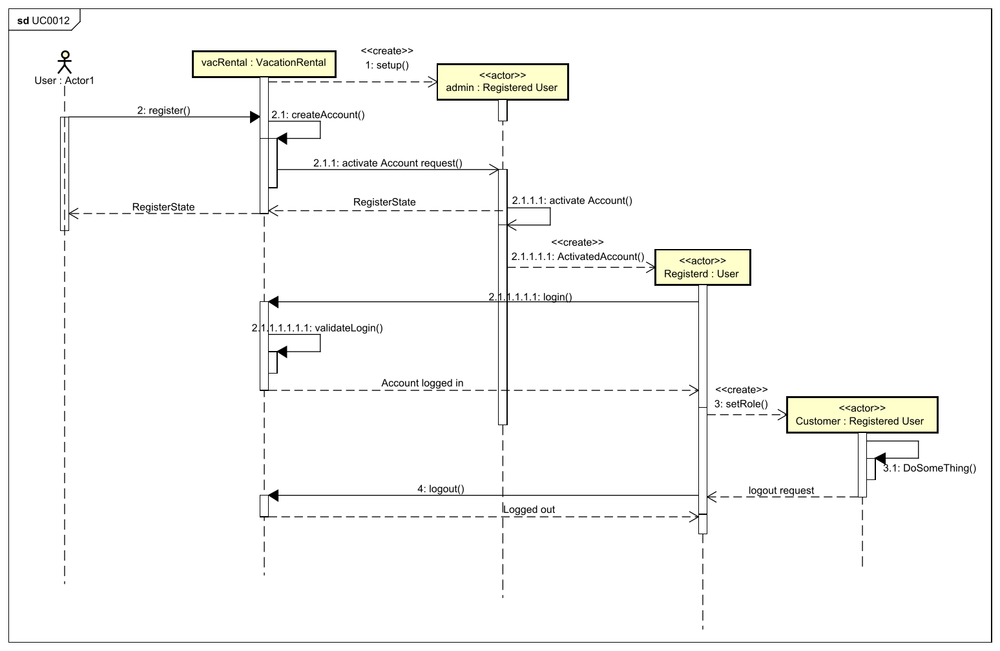

[cols="1h, 3"]
[[UC0014]]
[%autowidth]
|===
|ID|**<<UC0014>>**
|Name|Activate Account
|Akteur(e)|Admin
|Beschreibung|Der Administrator aktiviert ein neu erstelltes Konto.
|Vorbedingungen|Das zu aktivierende Konto existiert.
|Auslöser|Ein Benutzer hat sich registriert (lassen) und wartet darauf, dass sein Konto aktiviert wird.
|Notwendige Schritte a|
- Der Administrator navigiert zum Bereich "Nutzerübersicht / Ausstehende Freischaltungen"
- Der Administrator wählt das freizuschaltende Konto
- Der Administrator drückt auf den Knopf "Konto aktivieren"
|Erweitert a|-
|Funktionale Anforderungen| [<<F0022>>]
|===

[cols="1h, 3"]
[[UC0015]]
[%autowidth]
|===
|ID|**<<UC0015>>**
|Name|Delete Account
|Akteur(e)|Registered User, Admin
|Beschreibung|Der registrierte Benutzer löscht seinen eigenes Konto ODER der Administrator löscht ein bestehendes Nutzerkonto.
|Vorbedingungen|Das zu löschende Konto existiert.
|Auslöser|Ein Benutzer möchte sein Konto löschen oder der Administrator will ein Konto löschen.
|Notwendige Schritte a|
- Der registrierte Benutzer navigiert zum Bereich "Mein Konto" +
ODER: Der Administrator navigiert zum Bereich "Nutzerübersicht", wählt das zu betreffende Konto
- Der registrierte Benutzer bzw. der Administrator drückt auf den Knopf "Konto löschen"
|Erweitert a|-
|Funktionale Anforderungen| [<<F0022>>]
|===

[cols="1h, 3"]
[[UC0016]]
[%autowidth]
|===
|ID|**<<UC0016>>**
|Name|Create Account
|Akteur(e)|Admin
|Beschreibung|Der Administrator legt ein neues Konto für Vermieter oder Eventmitarbeiter an.
|Vorbedingungen|-
|Auslöser|Ein Vermieter oder Eventmitarbeiter möchte ein Konto für die Plattform erhalten.
|Notwendige Schritte a|
- Der Administrator navigiert zum Bereich "Nutzerübersicht / Neues Konto anlegen"
- Der Administrator wählt die Art des neuen Kontos und füllt die Daten in das Formular
- Der Administrator drückt auf den Knopf "Konto erstellen"
|Erweitert a|
- beinhaltet **<<UC0014>>**
|Funktionale Anforderungen| [<<F0022>>]
|===

[cols="1h, 3"]
[[UC0017]]
[%autowidth]
|===
|ID|**<<UC0017>>**
|Name|View Accounts
|Akteur(e)|Admin
|Beschreibung|Der Administrator hat Zugriff auf eine Liste mit allen existierenden Konten.
|Vorbedingungen|-
|Auslöser|Der Administrator möchte eine Liste aller registrierten Benutzer einsehen.
|Notwendige Schritte a|
- Der Administrator navigiert zum Bereich "Nutzerübersicht"
|Erweitert a|-
|Funktionale Anforderungen| [<<F0023>>]
|===

[cols="1h, 3"]
[[UC0018]]
[%autowidth]
|===
|ID|**<<UC0018>>**
|Name|View Account Details
|Akteur(e)|Registered User, Admin
|Beschreibung|Der registrierte Benutzer kann alle Details zu seinem Konto einsehen ODER der Administrator kann alle Details zu einem beliebigen Konto einsehen. Die Details beinhalten u.a. Persönliche Daten, Buchungshistorie, vermietete Häuser, Eventhistorie.
|Vorbedingungen|Der registrierte Benutzer ist in seinem Konto angemeldet ODER der registrierte Benutzer hat die Rolle "Administrator"
|Auslöser|Der Administrator möchte sich die Details und die Historie eines Kontos ansehen.
|Notwendige Schritte a|
- Der registrierte Benutzer navigiert zum Bereich "Mein Konto" +
ODER: Der Administrator navigiert zum Bereich "Nutzerübersicht" und wählt das betreffende Konto
|Erweitert a|-
|Funktionale Anforderungen| [<<F0024>>]
|===

[cols="1h, 3"]
[[UC0021]]
[%autowidth]
|===
|ID|**<<UC0021>>**
|Name|View Rental Catalog
|Akteur(e)|User
|Beschreibung|Benutzer können eine Liste mit allen verfügbaren Häusern ansehen.
|Vorbedingungen|-
|Auslöser|Der Benutzer möchte sich die verfügbaren Häuser ansehen.
|Notwendige Schritte a|
- Der Benutzer navigiert zum Bereich "Ferienhäuser"
- Gegebenenfalls wählt der Benutzer einen Zeitraum aus, was die Häuserauswahl einschränkt
|Erweitert a|-
|Funktionale Anforderungen| [<<F0100>>] [<<F0101>>] [<<F0110>>]
|===

[cols="1h, 3"]
[[UC0022]]
[%autowidth]
|===
|ID|**<<UC0022>>**
|Name|View House Details
|Akteur(e)|User
|Beschreibung|Benutzer können eine Seite mit detaillierten Informationen zu dem Haus aufrufen.
|Vorbedingungen|Das Haus existiert.
|Auslöser|Der Benutzer möchte sich die Details eines Ferienhauses ansehen.
|Notwendige Schritte a|
- Der Benutzer navigiert zum Bereich "Ferienhäuser"
- Der Benutzer wählt das betreffende Haus
- Oder: Der Benutzer navigiert zum Bereich "Meine Buchungen", wählt eine Buchung und kann dort das entsprechende Haus auswählen
|Erweitert a|-
|Funktionale Anforderungen| [<<F0111>>]
|===

[cols="1h, 3"]
[[UC0023]]
[%autowidth]
|===
|ID|**<<UC0023>>**
|Name|Add House
|Akteur(e)|Landlord
|Beschreibung|Der Vermieter kann neue Häuser hinzufügen.
|Vorbedingungen|-
|Auslöser|Der Vermieter möchte ein neues Haus zur Plattform hinzufügen.
|Notwendige Schritte a|
- Der Vermieter navigiert zum Bereich "Meine Häuser / Haus hinzufügen"
- Der Vermieter füllt das Formular aus und bestätigt mit Klick auf den Knopf "Haus hinzufügen"
|Erweitert a|-
|Funktionale Anforderungen| [<<F0120>>]
|===

[cols="1h, 3"]
[[UC0024]]
[%autowidth]
|===
|ID|**<<UC0024>>**
|Name|Edit House
|Akteur(e)|Landlord
|Beschreibung|Der Vermieter kann existierende Häuser bearbeiten.
|Vorbedingungen|Das Haus existiert.
|Auslöser|Der Vermieter möchte die Informationen zu einem seiner Häuser bearbeiten.
|Notwendige Schritte a|
- Der Vermieter navigiert zum Bereich "Meine Häuser"
- Der Vermieter wählt das betreffende Haus
- Der Vermieter wählt "Informationen bearbeiten"
- Der Vermieter ändert die betreffenden Informationen im Formular
- Der Vermieter drückt auf den Knopf "Änderungen speichern"
|Erweitert a|
- erweitert durch **<<UC0028>>**
|Funktionale Anforderungen| [<<F0121>>]
|===

[cols="1h, 3"]
[[UC0025]]
[%autowidth]
|===
|ID|**<<UC0025>>**
|Name|Delete House
|Akteur(e)|Landlord
|Beschreibung|Der Vermieter kann existierende Häuser löschen.
|Vorbedingungen|Das Haus existiert.
|Auslöser|Der Vermieter möchte eines seiner Häuser von der Plattform löschen.
|Notwendige Schritte a|
- Der Vermieter navigiert zum Bereich "Meine Häuser"
- Der Vermieter wählt das betreffende Haus
- Der Vermieter drückt auf den Knopf "Haus löschen"
|Erweitert a|-
|Funktionale Anforderungen| [<<F0122>>]
|===

[cols="1h, 3"]
[[UC0026]]
[%autowidth]
|===
|ID|**<<UC0026>>**
|Name|View History
|Akteur(e)|Landlord
|Beschreibung|Der Vermieter kann sich alle früheren, sowie aktuelle Buchungen und Reservierungen und alle Events für ein Haus anzeigen lassen.
|Vorbedingungen|Das Haus existiert.
|Auslöser|Der Vermieter möchte sich die Buchungshistorie eines seiner Häuser ansehen.
|Notwendige Schritte a|
- Der Vermieter navigiert zum Bereich "Meine Häuser"
- Der Vermieter wählt das betreffende Haus
|Erweitert a|-
|Funktionale Anforderungen| [<<F0130>>] [<<F0131>>]
|===

[[sequence_diagram_UC0027]]
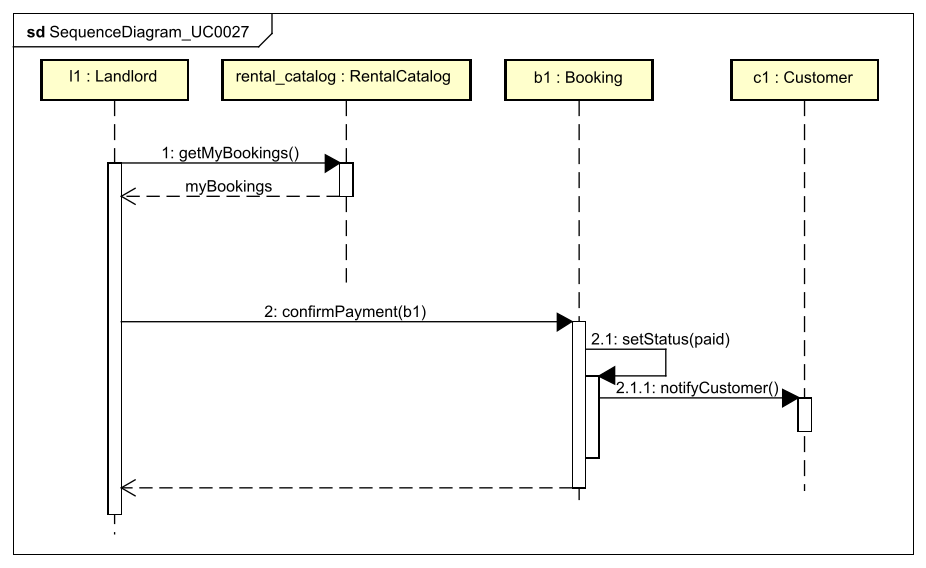

[cols="1h, 3"]
[[UC0027]]
[%autowidth]
|===
|ID|**<<UC0027>>**
|Name|Confirm Payment
|Akteur(e)|Landlord
|Beschreibung|Der Vermieter bestätigt eine eingegangene Zahlung für eine Buchung.
|Vorbedingungen|Ein Kunde hat ein Haus gebucht und den Betrag an den Vermieter gezahlt.
|Auslöser|Der Vermieter möchte dem Kunden den Eingang der Zahlung bestätigen.
|Notwendige Schritte a|
- Der Vermieter navigiert zum Bereich "Meine Häuser / Buchungen"
- Der Vermieter wählt die betreffende Buchung aus
- Der Vermieter drückt auf den Knopf "Zahlungseingang bestätigen"
|Erweitert a|-
|Funktionale Anforderungen| [<<F0132>>]
|===

[cols="1h, 3"]
[[UC0028]]
[%autowidth]
|===
|ID|**<<UC0028>>**
|Name|Manage Images
|Akteur(e)|Landlord
|Beschreibung|Der Vermieter kann Bilder von seinem Haus hochladen, ändern oder löschen.
|Vorbedingungen|Der Vermieter ist dabei die Informationen des Hauses zu bearbeiten (**<<UC0024>>**).
|Auslöser|Der Vermieter möchte die Bilder eines Hauses verwalten.
|Notwendige Schritte a|
- Der Vermieter drückt auf den Knopf "Bilder hochladen," um per Dateidialog neue Bilder hochzuladen
- Oder: Der Vermieter wählt die zu löschenden Bilder aus und drückt auf den Knopf "Bilder löschen"
|Erweitert a|-
|Funktionale Anforderungen| [<<F0133>>]
|===

[cols="1h, 3"]
[[UC0031]]
[%autowidth]
|===
|ID|**<<UC0031>>**
|Name|Reserve House
|Akteur(e)|Customer
|Beschreibung|Der Kunde reserviert ein Haus.
|Vorbedingungen|Das Haus ist im gewählten Zeitraum noch nicht von einem anderen Kunden reserviert oder gebucht.
|Auslöser|Der Kunde möchte ein Haus reservieren.
|Notwendige Schritte a|
- Der Kunde wählt das Haus im Katalog aus
- Der Kunde wählt einen Zeitraum
- Der Kunde drückt auf den Knopf "Für ausgewählten Zeitraum reservieren"
|Erweitert a|
- erweitert durch **<<UC0033>>**
|Funktionale Anforderungen| [<<F0301>>]
|===

[cols="1h, 3"]
[[UC0032]]
[%autowidth]
|===
|ID|**<<UC0032>>**
|Name|Pay Deposit
|Akteur(e)|Customer
|Beschreibung|Der Kunde leistet eine Anzahlung.
|Vorbedingungen|Der Kunde hat ein Haus gebucht und die Frist für die Anzahlung ist noch nicht abgelaufen.
|Auslöser|Der Kunde möchte durch die Anzahlung seine Buchung beim Vermieter bestätigen lassen. +

*Bemerkung*: Die eigentliche Zahlung ist im System nicht abgebildet und wird von externen Zahlungsdienstleistern übernommen.
|Notwendige Schritte a|
- Der Kunde navigiert zum Bereich "Meine Buchungen"
- Der Kunde wählt die betreffende Buchung aus
- Der Kunde drückt auf den Knopf "Anzahlung überweisen"
|Erweitert a|
- beinhaltet **<<UC0034>>**
|Funktionale Anforderungen| [<<F0302>>]
|===

[[sequence_diagram_UC0033]]
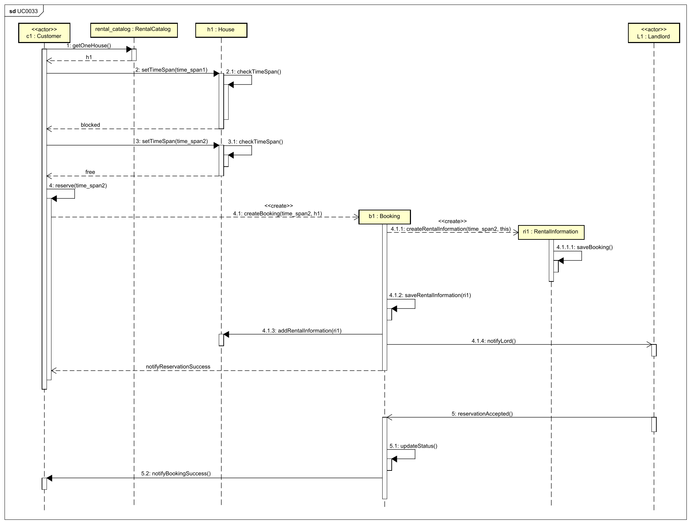

[cols="1h, 3"]
[[UC0033]]
[%autowidth]
|===
|ID|**<<UC0033>>**
|Name|Rent House
|Akteur(e)|Customer
|Beschreibung|Der Kunde bucht ein Haus. Falls in dem betreffenden Zeitraum das Haus für ein Event gebucht ist, muss der Kunde zusätzlich ein Ticket für das Event kaufen.
|Vorbedingungen|Das Haus ist im gewählten Zeitraum noch nicht von einem anderen Kunden reserviert oder gebucht, aber der Kunde hat das Haus bereits reserviert.
|Auslöser|Der Kunde möchte das Haus endgültig buchen, nachdem er es bereits reserviert hat.
|Notwendige Schritte a|
- Der Kunde navigiert zu "Meine Reservierungen"
- Der Kunde wählt die betreffende Reservierung aus
- Der Kunde leistet die Anzahlung (**<<UC0032>>**)
- Der Vermieter des Hauses bestätigt die Buchung (**<<UC0034>>**)
|Erweitert a|
- beinhaltet **<<UC0032>>**  
- erweitert durch **<<UC0041>>**
|Funktionale Anforderungen| [<<F0303>>]
|===

[cols="1h, 3"]
[[UC0034]]
[%autowidth]
|===
|ID|**<<UC0034>>**
|Name|Approve Booking
|Akteur(e)|Landlord
|Beschreibung|Der Vermieter bestätigt eine Buchung oder lehnt sie ab.
|Vorbedingungen|Die Buchung existiert.
|Auslöser|Ein Kunde hat eine Buchungsanfrage für einen Zeitraum gestellt.
|Notwendige Schritte a|
- Der Vermieter navigiert zum Bereich "Meine Häuser / Buchungen / Anfragen"
- Der Vermieter wählt die betreffende Buchungsanfrage aus
- Der Vermieter drückt auf den Knopf "Buchung bestätigen" ODER "Buchung ablehnen"
|Erweitert a|-
|Funktionale Anforderungen| [<<F0304>>]
|===

[cols="1h, 3"]
[[UC0035]]
[%autowidth]
|===
|ID|**<<UC0035>>**
|Name|Refund Deposit
|Akteur(e)|Landlord
|Beschreibung|Der Vermieter erstattet die Anzahlung für eine Buchung. +

*Bemerkung*: Die eigentliche Zahlung ist im System nicht abgebildet und wird von externen Zahlungsdienstleistern übernommen.
|Vorbedingungen|Ein Kunde hat eine Anzahlung für eine Buchung getätigt und die Anzahlung bereits überwiesen.
|Auslöser|Der Vermieter möchte die Buchung stornieren.
|Notwendige Schritte a|
- Der Vermieter navigiert zum Bereich "Meine Häuser / Buchungen"
- Der Vermieter wählt die betreffende Buchung aus
- Der Vermieter drückt auf den Knopf "Anzahlung zurückerstatten"
|Erweitert a|-
|Funktionale Anforderungen| [<<F0305>>]
|===

[cols="1h, 3"]
[[UC0036]]
[%autowidth]
|===
|ID|**<<UC0036>>**
|Name|Cancel Booking
|Akteur(e)|Customer, Landlord
|Beschreibung|Die Buchung wird durch den Kunden oder den Vermieter storniert.
|Vorbedingungen|Der Kunde hat eine Buchung getätigt.
|Auslöser|Der Kunde oder der Vermieter möchte die Buchung stornieren.
|Notwendige Schritte a|
- Der Kunde navigiert zum Bereich "Meine Buchungen" +
ODER: Der Vermieter navigiert zum Bereich "Meine Häuser / Buchungen"
- Der Kunde / der Vermieter wählt die betreffende Buchung
- Der Kunde / der Vermieter drückt auf Knopf "Buchung stornieren"
|Erweitert a|
- erweitert durch **<<UC0035>>**, falls der Stornierungszeitpunkt innerhalb der Frist liegt.
|Funktionale Anforderungen| [<<F0306>>]
|===

[cols="1h, 3"]
[[UC0037]]
[%autowidth]
|===
|ID|**<<UC0037>>**
|Name|View Booking
|Akteur(e)|Customer
|Beschreibung|Der Kunde kann sich seine Buchungen anschauen.
|Vorbedingungen|Die Buchung existiert.
|Auslöser|Der Kunde möchte sich eine Übersicht mit allen seinen Buchungen ansehen.
|Notwendige Schritte a|
- Der Kunde navigiert zum Bereich "Meine Buchungen"
|Erweitert a|-
|Funktionale Anforderungen| [<<F0307>>]
|===

[cols="1h, 3"]
[[UC0041]]
[%autowidth]
|===
|ID|**<<UC0041>>**
|Name|Book Event Ticket
|Akteur(e)|Customer
|Beschreibung|Der Kunde bucht ein Event Ticket.
|Vorbedingungen|Das Event existiert.
|Auslöser|Der Kunde möchte ein großes Event besuchen und hat dafür bereits für ein teilnehmendes Haus eine Buchung getätigt.
|Notwendige Schritte a|
- Der Kunde hat bereits das zugehörige Haus gebucht
- Der Kunde drückt auf den Knopf "Ticket dazu buchen" ODER der Kunde bricht die gesamte Buchung (inklusive die des Hauses) ab, indem er auf den Knopf "Buchung stornieren" drückt.
|Erweitert a|-
|Funktionale Anforderungen| [<<F0401>>]
|===

[cols="1h, 3"]
[[UC0042]]
[%autowidth]
|===
|ID|**<<UC0042>>**
|Name|Edit Event
|Akteur(e)|EventStaff
|Beschreibung|Ein Eventmitarbeiter bearbeitet die Event informationen.
|Vorbedingungen|Das Event existiert.
|Auslöser|Ein Eventmitarbeiter möchte die Details des Events bearbeiten.
|Notwendige Schritte a|
- Der Eventmitarbeiter navigiert zu "Meine Events"
- Der Eventmitarbeiter wählt das betreffende Event aus
- Der Eventmitarbeiter "Informationen bearbeiten"
- Der Eventmitarbeiter ändert die betreffenden Informationen im Formular
- Der Eventmitarbeiter drückt auf den Knopf "Änderungen speichern"
|Erweitert a|
- erweitert durch **<<UC0048>>**
|Funktionale Anforderungen| [<<F0400>>] [<<F0402>>]
|===

[[sequence_diagram_UC0043]]
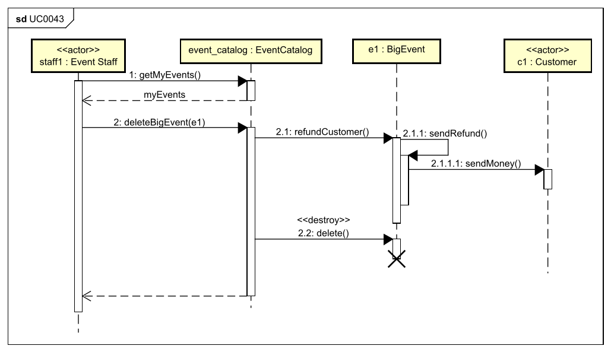

[cols="1h, 3"]
[[UC0043]]
[%autowidth]
|===
|ID|**<<UC0043>>**
|Name|Delete Event
|Akteur(e)|EventStaff
|Beschreibung|Ein Eventmitarbeiter löscht das Event.
|Vorbedingungen|Das Event existiert.
|Auslöser|Ein Eventmitarbeiter möchte ein Event löschen.
|Notwendige Schritte a|
- Der Eventmitarbeiter navigiert zum Bereich "Meine Events"
- Der Eventmitarbeiter wählt das betreffende Event
- Der Eventmitarbeiter drückt auf den Knopf "Event löschen"
|Erweitert a|
- beinhaltet **<<UC0044>>**
|Funktionale Anforderungen| [<<F0400>>] [<<F0403>>]
|===

[cols="1h, 3"]
[[UC0044]]
[%autowidth]
|===
|ID|**<<UC0044>>**
|Name|Refund Visitors
|Akteur(e)|EventStaff
|Beschreibung|Allen Eventbesuchern wird das Ticket zurückerstattet. +

*Bemerkung*: Die eigentliche Zahlung ist im System nicht abgebildet und wird von externen Zahlungsdienstleistern übernommen.
|Vorbedingungen|-
|Auslöser|Ein Event mit verkauften Tickets wurde gelöscht.
|Notwendige Schritte a|
- Der Eventmitarbeiter navigiert zum Bereich "Meine Events / Abgesagte Events"
- Der Eventmitarbeiter wählt das betreffende Event
- Der Eventmitarbeiter drückt auf den Knopf "Tickets zurückerstatten"
|Erweitert a|-
|Funktionale Anforderungen| [<<F0404>>]
|===

[[sequence_diagram_UC0045]]
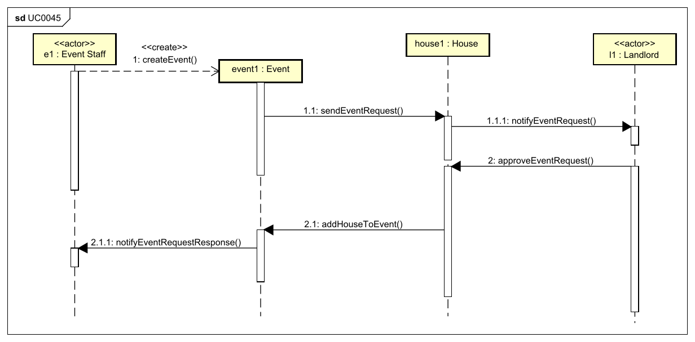

[cols="1h, 3"]
[[UC0045]]
[%autowidth]
|===
|ID|**<<UC0045>>**
|Name|Approve Event
|Akteur(e)|Landlord
|Beschreibung|Der Vermieter bestätigt, dass das Event in seinem Haus stattfinden kann oder lehnt die Anfrage ab.
|Vorbedingungen|Das Haus ist für den angefragten Zeitraum noch nicht gebucht oder reserviert.
|Auslöser|Ein Eventmitarbeiter hat bei einem Haus angefragt, ob es Teil eines Events werden kann.
|Notwendige Schritte a|
- Der Vermieter navigiert zum Bereich "Meine Häuser / Eventanfragen"
- Der Vermieter wählt die betreffende Anfrage
- Der Vermieter drückt auf Knopf "Anfrage akzeptieren" ODER "Anfrage ablehnen"
|Erweitert a|-
|Funktionale Anforderungen| [<<F0405>>] [<<F0406>>]
|===

[cols="1h, 3"]
[[UC0046]]
[%autowidth]
|===
|ID|**<<UC0046>>**
|Name|Request House
|Akteur(e)|EventStaff
|Beschreibung|Ein Eventmitarbeiter fragt für ein Haus bei dessen Vermieter an, ob es für ein Event gebucht werden kann.
|Vorbedingungen|Das Haus ist für den angefragten Zeitraum noch nicht gebucht oder reserviert.
|Auslöser|Ein Eventmitarbeiter möchte bei einem Haus anfragen, ob es Teil eines Events werden kann.
|Notwendige Schritte a|
- Der Eventmitarbeiter navigiert zum Bereich "Meine Events"
- Der Eventmitarbeiter wählt das betreffende Event
- Der Eventmitarbeiter drückt auf den Knopf "Häuser anfragen"
- Der Eventmitarbeiter wählt eines oder mehrere der angezeigten Häuser aus, welche sich in der Nähe des Event-Veranstaltungsortes befinden
- Der Eventmitarbeiter drückt den Knopf "Anfrage(n) abschicken"
|Erweitert a|
- beinhaltet **<<UC0045>>**
|Funktionale Anforderungen| [<<F0406>>]
|===

[cols="1h, 3"]
[[UC0047]]
[%autowidth]
|===
|ID|**<<UC0047>>**
|Name|Create Event
|Akteur(e)|EventStaff
|Beschreibung|Ein Eventmitarbeiter erstellt ein Event.
|Vorbedingungen|-
|Auslöser|Ein Eventmitarbeiter möchte ein neues Event anlegen.
|Notwendige Schritte a|
- Der Eventmitarbeiter navigiert zum Bereich "Meine Events / Event hinzufügen"
- Der Eventmitarbeiter wählt die Art des Events
- Der Eventmitarbeiter füllt das Formular aus und bestätigt mit Druck auf den Knopf "Event hinzufügen"
|Erweitert a|
- erweitert durch **<<UC0046>>**
|Funktionale Anforderungen| [<<F0407>>]
|===

[cols="1h, 3"]
[[UC0048]]
[%autowidth]
|===
|ID|**<<UC0048>>**
|Name|Manage Images
|Akteur(e)|EventStaff
|Beschreibung|Ein Eventmitarbeiter kann Bilder vom Event hochladen, ändern oder löschen.
|Vorbedingungen|Der Eventmitarbeiter ist dabei die Informationen des Events zu bearbeiten (**<<UC0042>>**).
|Auslöser|Ein Eventmitarbeiter möchte die Bilder eines Events verwalten.
|Notwendige Schritte a|
- Der Eventmitarbeiter drückt auf den Knopf "Bilder hochladen," um per Dateidialog neue Bilder hochzuladen
- Oder: Der Eventmitarbeiter wählt die zu löschenden Bilder aus und drückt auf den Knopf "Bilder löschen"
|Erweitert a|-
|Funktionale Anforderungen| [<<F0408>>]
|===

== Funktionale Anforderungen

Dieser Abschnitt gibt einen Überblick über die funktionalen Anforderungen des Systems.

Die Tabelle enthält:

    - Eine einzigartige ID, die über das gesamte Projekt als Referenz benutzt werden kann
    - Die aktuelle Version der Anforderung, da sich diese während der Arbeit am Projekt verändern kann
    - Der Name der Anforderung
    - Die Beschreibung der jeweiligen Anforderung

NOTE: Eine funktionale Anforderung definiert eine Funktion des Systems, welche implementiert werden soll, um den Anforderungen des Kunden zu entsprechen. Sie enthält im Idealfall die Inputs, das geplante Verhalten und das Ergebnis.

NOTE: Die funktionalen Anforderungen zeigen auf, was genau implementiert werden muss. Da use cases relativ nah zu der domain sind und größtenteils nicht technisch, ist es notwendig die vom Kunden gegebenen Funktionen zu spezifizieren und organisieren.

=== Muss-Kriterien

[options="header", cols="2h, 1, 3, 12"]
|===
|ID
|Version
|Name
|Description

|[[F0010]]<<F0010>>
|v0.1
|Authentication
a|
Das System sollte unterteilt sein in öffentlich zugängliche Teile und Teile die eine Authentifizierung benötigen. Wenn ein Benutzer im System vorhanden ist, sollte er sich authentifizieren können durch die Angabe folgender Informationen:
  
    - Benutzername
    - Passwort

|[[F0020]]<<F0020>>
|v0.1
|Register
a|
Das System sollte einem unauthentifizierten Benutzer (<<F0010>>) nach Aufrufen des Navigationselements „Registrieren“ die Möglichkeit bieten sich zu registrieren.
Die folgenden Informationen müssen angegeben werden:

    - Benutzername (einzigartig)
    - Passwort
    - Adresse

Das System sollte die angegebenen Daten validieren (<<F0021>>).
Der Benutzer sollte im System registriert werden und sollte sich nach erfolgreicher Validierung authentifizieren (<<F0010>>) können. 

|[[F0021]]<<F0021>>
|v0.1
|Register Validation
a|
Das System sollte die angegebenen Daten eines unregistrierten Nutzers validieren.

Die Einzigartigkeit des Benutzernamen sollte garantiert werden.
Der Benutzer sollte über Verletzungen der Vorschriften informiert werden.

|[[F0022]]<<F0022>>
|v0.1
|Account Management
a|
Das System sollte einem authentifizierten Benutzer (<<F0010>>) mit der Rolle Admin die Möglichkeit bieten, registrierte Nutzeraccounts (<<F0020>>) zu aktivieren.

Das System sollte einem authentifizierten Benutzer (<<F0010>>) mit der Rolle Admin die Möglichkeit bieten, registrierte Nutzeraccounts (<<F0020>>) zu löschen.

Das System sollte einem authentifizierten Benutzer (<<F0010>>) mit der Rolle Admin die Möglichkeit bieten, einen neuen Benutzer mit der Rolle Landlord oder EventStaff zu registrieren (<<F0020>>).

|[[F0023]]<<F0023>>
|v0.1
|View Accounts
a|
Das System sollte einem authentifizierten Benutzer (<<F0010>>) mit der Rolle Admin die Möglichkeit bieten, eine Liste mit allen registrierten Nutzeraccount (<<F0020>>) anzeigen zu lassen.

|[[F0024]]<<F0024>>
|v0.1
|View Account Details
a|
Das System sollte einem authentifizierten Benutzer (<<F0010>>) mit der Rolle Admin die Möglichkeit bieten, sich alle Informationen zu einem Nutzeraccount (<<F0020>>) anzeigen zu lassen, das beinhaltet u.a. Persönliche Daten, Buchungshistorie, vermietete Häuser und Eventhistorie (<<F0130>>).

|[[F0100]]<<F0100>>
|v0.1
|Rental Catalog
a|
Das System sollte langfristig Daten über Häuser in einem Rental Catalog speichern.

|[[F0101]]<<F0101>>
|v0.1
|Change Status
a|
Das System sollte in der Lage sein den Status eines Hauses zu verändern.

|[[F0110]]<<F0110>>
|v0.1
|View Rental Catalog
a|
Das System sollte Nutzern die Möglichkeit bieten eine Liste mit allen Häusern anzeigen zu lassen.

|[[F0111]]<<F0111>>
|v0.1
|View House Details
a|
Das System sollte Nutzern die Möglichkeit bieten, detaillierte Informationen zu einem Haus anzeigen zu lassen.

|[[F0120]]<<F0120>>
|v0.1
|Add House
a|
Das System sollte einem authentifizierten Benutzer (<<F0010>>) mit der Rolle Landlord die Möglichkeit bieten, Häuser zum Rental Catalog (<<F0100>>) hinzuzufügen.

|[[F0121]]<<F0121>>
|v0.1
|Edit House
a|
Das System sollte einem authentifizierten Benutzer (<<F0010>>) mit der Rolle Landlord die Möglichkeit bieten, seine Häuser im Rental Catalog (<<F0100>>) zu bearbeiten.

|[[F0122]]<<F0122>>
|v0.1
|Delete House
a|
Das System sollte einem authentifizierten Benutzer (<<F0010>>) mit der Rolle Landlord die Möglichkeit bieten, seine Häuser aus dem Rental Catalog (<<F0100>>) zu löschen.

|[[F0130]]<<F0130>>
|v0.1
|History
a|
Das System sollte langfristig Daten über die Buchungen (<<F0303>>), Reservierungen (<<F0301>>) und Events (<<F0401>>) der Häuser in einer History speichern.

|[[F0131]]<<F0131>>
|v0.1
|View History
a|
Das System sollte einem authentifizierten Benutzer (<<F0010>>) mit der Rolle Landlord die Möglichkeit bieten, die History (<<F0130>>) anzeigen zu lassen.

|[[F0132]]<<F0132>>
|v0.1
|Confirm Payment
a|
Das System sollte einem authentifizierten Benutzer (<<F0010>>) mit der Rolle Landlord die Möglichkeit bieten, nach eingegangener Zahlung für eine Buchung (<<F0303>>) den Eingang dieser zu bestätigen.

|[[F0133]]<<F0133>>
|v0.1
|Manage Images
a|
Das System sollte einem authentifizierten Benutzer (<<F0010>>) mit der Rolle Landlord die Möglichkeit bieten, Bilder von seinem Haus hochzuladen, zu ändern und zu löschen.

|[[F0301]]<<F0301>>
|v0.1
|Reserve House
a|
Das System sollte einem authentifizierten Benutzer (<<F0010>>) mit der Rolle Customer die Möglichkeit bieten, ein Haus zu reservieren.

|[[F0302]]<<F0302>>
|v0.1
|Pay Deposit
a|
Das System sollte einem authentifizierten Benutzer (<<F0010>>) mit der Rolle Customer die Möglichkeit bieten,  nach Annehmen der Buchung (<<F0304>>), eine Anzahlung zu leisten.

|[[F0303]]<<F0303>>
|v0.1
|Rent House
a|
Das System sollte einem authentifizierten Benutzer (<<F0010>>) mit der Rolle  Customer, nach Leistung einer Anzahlung (<<F0302>>) die Möglichkeit bieten, ein Haus zu mieten.

|[[F0304]]<<F0304>>
|v0.1
|Approve Booking
a|
Das System sollte einem authentifizierten Benutzer (<<F0010>>) mit der Rolle Landlord die Möglichkeit bieten, eine Buchung (<<F0301>>) anzunehmen oder abzulehnen.

|[[F0305]]<<F0305>>
|v0.1
|Refund Deposit
a|
Das System sollte einem authentifizierten Benutzer (<<F0010>>) mit der Rolle Landlord die Möglichkeit bieten, ein Deposit (<<F0302>>) zurückzuzahlen.

|[[F0306]]<<F0306>>
|v0.1
|Cancel Booking
a|
Das System sollte einem authentifizierten Benutzer (<<F0010>>) mit der Rolle Customer und Landlord die Möglichkeit bieten, eine Buchung zu stornieren.

|[[F0307]]<<F0307>>
|v0.1
|View Booking
a|
Das System sollte einem authentifizierten Benutzer (<<F0010>>) mit der Rolle Customer die Möglichkeit bieten, seine Buchungen einzusehen.

|[[F0400]]<<F0400>>
|v0.1
|Event Catalog
a|
Das System sollte langfristig Daten über Events in einem Event Catalog speichern.

|[[F0401]]<<F0401>>
|v0.1
|Book Event Ticket
a|
Das System sollte einem authentifizierten Benutzer (<<F0010>>) mit der Rolle Customer die Möglichkeit bieten, ein Event Ticket zu buchen.

|[[F0402]]<<F0402>>
|v0.1
|Edit Event
a|
Das System sollte einem authentifizierten Benutzer (<<F0010>>) mit der Rolle EventStaff die Möglichkeit bieten, ein Event im Event Catalog (<<F0400>>) zu bearbeiten.

|[[F0403]]<<F0403>>
|v0.1
|Delete Event
a|
Das System sollte einem authentifizierten Benutzer (<<F0010>>) mit der Rolle EventStaff die Möglichkeit bieten, ein Event im Event Catalog (<<F0400>>) zu löschen.

|[[F0404]]<<F0404>>
|v0.1
|Refund Visitors
a|
Das System sollte einem authentifizierten Benutzer (<<F0010>>) mit der Rolle EventStaff die Möglichkeit bieten, allen Customer die ein Event gebucht (<<F0401>>) haben ihr Geld zurückzuerstatten.

|[[F0405]]<<F0405>>
|v0.1
|Approve Event
a|
Das System sollte einem authentifizierten Benutzer (<<F0010>>) mit der Rolle Landlord die Möglichkeit bieten, Anfragen (<<F0406>>) zur Nutzung seines Hauses als Veranstaltungsort anzunehmen oder abzulehnen.

|[[F0406]]<<F0406>>
|v0.1
|Request House
a|
Das System sollte einem authentifizierten Benutzer (<<F0010>>) mit der Rolle EventStaff die Möglichkeit bieten, bei einem Landlord anzufragen, ob ein Haus als Austragungsort für ein Event verwendet werden darf.

|[[F0407]]<<F0407>>
|v0.1
|Create Event
a|
Das System sollte einem authentifizierten Benutzer (<<F0010>>) mit der Rolle EventStaff die Möglichkeit bieten, ein Event zu erstellen.

|[[F0408]]<<F0408>>
|v0.1
|Manage Images
a|
Das System sollte einem authentifizierten Benutzer (<<F0010>>) mit der Rolle EventStaff die Möglichkeit bieten, Bilder vom Event hochzuladen, zu ändern und zu löschen.

|===

=== Kann-Kriterien
Anforderungen, die das Programm leisten können soll, aber für den korrekten Betrieb entbehrlich sind.

[options="header", cols="2h, 1, 3, 12"]
|===
|ID
|Version
|Name
|Description

|[[F0500]]<<F0500>>
|v0.1
|House Map
a|
Das System könnte dem Benutzer die Möglichkeit bieten, ein gewünschtes Haus auf einer Karte auszuwählen.

|[[F0501]]<<F0501>>
|v0.1
|Admin House Event Management
a|
Das System könnte einem authentifizierten Benutzer mit der Rolle Admin die Möglichkeit bieten, alle Tätigkeiten an Häusern und Events durchzuführen, wie Benutzer mit den Rollen Landlord und EventStaff.

|[[F0502]]<<F0502>>
|v0.1
|Report
a|
Das System könnte einen authentifizierten Benutzer mit der Rolle Customer die Möglichkeit bieten, Häuser und Events zu melden.

|[[F0503]]<<F0503>>
|v0.1
|Review
a|
Das System könnte einen authentifizierten Benutzer mit der Rolle Customer die Möglichkeit bieten, Häuser und Events zu bewerten.

|[[F0504]]<<F0504>>
|v0.1
|Password Validation
a|
Das System könnte validieren, dass der Benutzer ein sicheres Passwort benutzt.

|[[F0505]]<<F0505>>
|v0.1
|Profile Picture
a|
Das System könnte einen authentifizierten Benutzer die Möglichkeit bieten, ein Profilbild zu setzen.

|[[F0506]]<<F0506>>
|v0.1
|Language
a|
Das System könnte einem Benutzer die Möglichkeit bieten, die Anzeigesprache der Seite zu ändern.

|[[F0507]]<<F0507>>
|v0.1
|Light and Dark Mode
a|
Das System könnte einem Benutzer die Möglichkeit bieten, die angezeigte Seite zwischen einem hellen und einem dunklen Anzeigemodus umzuschalten.

|[[F0508]]<<F0508>>
|v0.1
|Notify User
a|
Das System könnte einem authentifizierten Benutzer Benachrichtigungen in eine Inbox senden, um ihn über gecancelte Buchungen oder neue Events zu informieren.
|===

== Nicht-Funktionale Anforderungen
=== Qualitätsziele

Dieser Abschnitt dokumentiert die Qualitätsziele, welche das System erreichen soll, sowie deren Priorität.

Die Priorisierung der Qualitätsziele wird durch eine Skala von 1 (unwichtig) bis 5 (essenziell) dargestellt.
[options="header", cols="3h, ^1, ^1, ^1, ^1, ^1"]
|===
|Qualitätsanspruch       | 1 | 2 | 3 | 4 | 5
|Wartbarkeit             |   |   |   | x |
|Benutzerfreundlichkeit  |   |   |   |   | x
|Sicherheit              |   |   |   | x |
|===

=== Konkrete Nicht-Funktionale Anforderungen

[options="header", cols="2h, 1, 1, 3, 12"]
|===
|ID
|Version
|Kategorie
|Name
|Beschreibung

|[[NF0010]]<<NF0010>>
|v0.1
|Wartbarkeit
|Einfach Erweiterbar
|Der Quellcode des Systems soll einfach zu warten und zu erweitern sein.

|[[NF0020]]<<NF0020>>
|v0.1
|Sicherheit
|Passwortsicherheit
|Passwörter werden aus Sicherheitsgründen nicht im Klartext, sondern als Hashwerte gespeichert.

|[[NF0030]]<<NF0030>>
|v0.1
|Benutzerfreundlichkeit
|Selbsterklärende Benutzeroberfläche
|Alle Funktionen des Systems sollen über eine selbsterklärende, intuitive Benutzeroberfläche zugänglich sein, sodass sich Benutzer jederzeit problemlos zurechtfinden.

|===

== GUI Prototyp

In diesem Kapitel wird der Entwurf der Navigationsmöglichkeiten und Dialoge des Systems erarbeitet. Ziel ist die Erstellung eines grafischen Prototyps zur visuellen Vorstellung.

=== Überblick: Dialoglandkarte
Erstellen Sie ein Übersichtsdiagramm, das das Zusammenspiel Ihrer Masken zur Laufzeit darstellt. Also mit welchen Aktionen zwischen den Masken navigiert wird.

image::./models/images/CustomerMap.svg[]
image::./models/images/LandlordMap.svg[]
image::./models/images/EventMap.svg[]
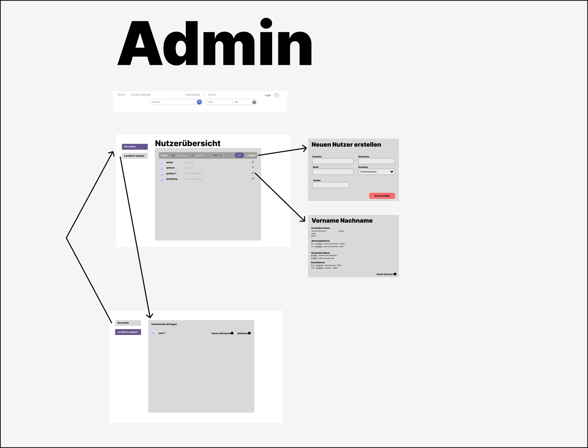
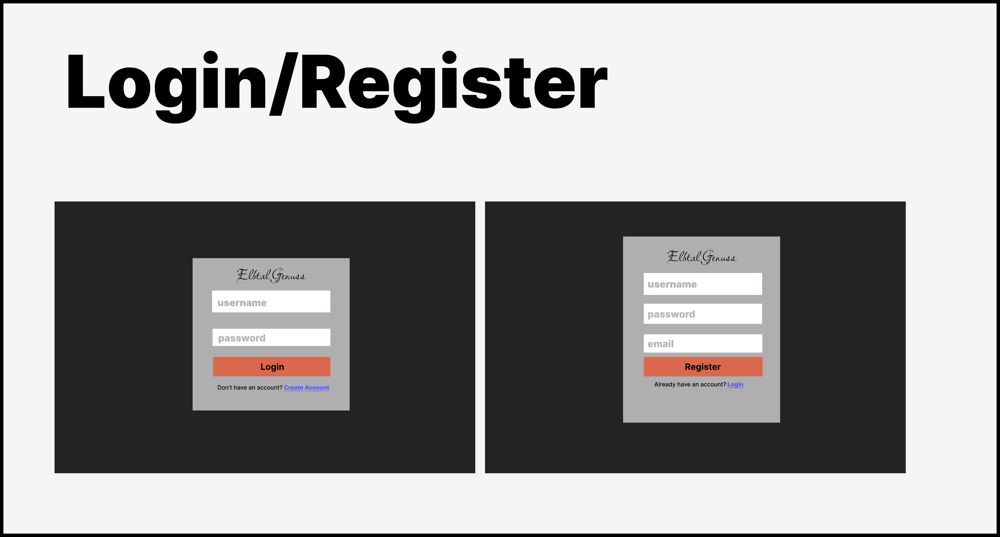

image::./models/images/CustomerDescription.svg[]
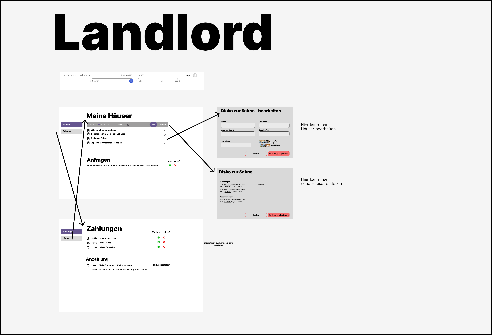
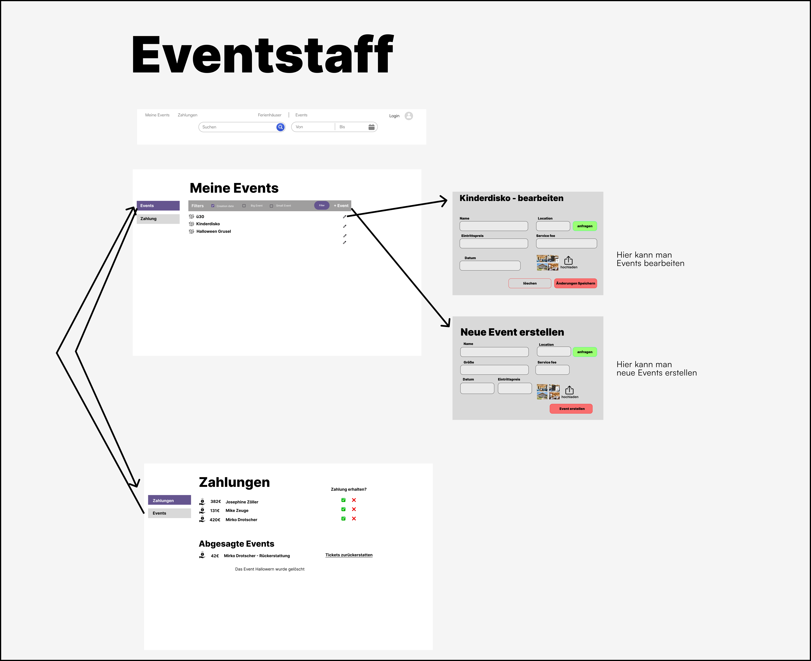
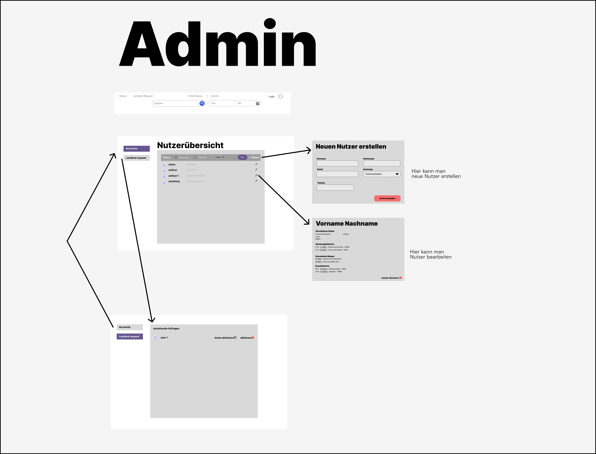

=== Dialogbeschreibung
==== Benutzer
[horizontal]
1:: Der Benutzer hat eine Suchfunktion (Suchen) und ein Feld um seine gewünschte Adresse zu schreiben und mit dem Lupenbutton zu suchen. neben der Suche kann er das gewünschte Datum dafür wählen (von welchem Datum bis wann es endet).
2:: Der Benutzer sieht auch eine Startseite mit 2 Abschnitten genannt Vorschläge und in der Nähe Sie. jedes Ferienhaus hat die Art der Immobilie, Adresse und Preis auf sie mit der Option, um sie mit dem Herz-Taste auf der oberen rechten Ecke jedes Ferienhauses zu favorisieren.
3:: Der Benutzer hat auch eine Kopfzeile mit den Ferienhäusern, auf denen er sich automatisch befindet, Veranstaltungen und Login.
4:: wenn der Suchbutton gedrückt wird, wird der Benutzer auf eine neue Seite mit einer Karte auf der rechten Seite und der Vermietung auf der linken Seite umgeleitet. die Häuser auf der Karte werden nach ihrem Preispunkt angezeigt. sobald der Preis angeklickt wird, wird das entsprechende Objekt auf der linken Seite angezeigt.
5:: Der Benutzer klickt auf ein haus und wird auf eine neue seite weitergeleitet, auf der weitere details zum haus angezeigt werden, z.b. bilder des ferienhauses, preis pro nacht, wie viele nächte der Benutzer gewählt hat, wie viele gäste er gewählt hat, und die verfügbarkeit, die in einem kalender angezeigt wird. wenn ein event mit dem haus verknüpft ist, hat der Benutzer die möglichkeit, ein ticket für das event zu kaufen. zusätzlich kann der Benutzer das ferienhaus reservieren.
6:: Der Benutzer wird auf die Reservierungsseite weitergeleitet, wo er weitere Details sieht, wie das An- und Abreisedatum, ein Bild des Ferienhauses, um sicherzustellen, dass es sich um das richtige Ferienhaus handelt, den zu zahlenden Gesamtbetrag und einen Hinweis unter der Reservierungsschaltfläche, der den Benutzer auffordert, 10 % des Gesamtbetrags zu zahlen, um das Ferienhaus zu reservieren.
7:: Der Benutzer drückt auf die Schaltfläche „Anmelden“ und wird auf eine Anmeldeseite weitergeleitet, auf der er sein Passwort und seinen Benutzernamen eingeben und mit der Schaltfläche „Anmelden“ absenden muss. Wenn er bereits ein Konto hat, kann er ein neues Konto erstellen, indem er auf (Konto erstellen) drückt.
8:: Nach der Anmeldung kann der Benutzer seinen Benutzernamen, seine E-Mail-Adresse, seine Telefonnummer, sein Profilbild, seine Reservierungen und Buchungen sehen. Der Benutzer kann sein Passwort mit (passwort ändern) ändern. Durch Drücken von (Meine Buchungen) wird der Benutzer zu seinen Buchungen weitergeleitet und sieht die Informationen, einschließlich, um welches Ferienhaus es sich handelt, die Option, den Gesamtbetrag zu senden, die Frist für die Überweisung daneben und eine Schaltfläche für die Erstattung. Durch Drücken von (Meine Reservierungen) wird der Benutzer zur Liste aller Reservierungen weitergeleitet. Wenn der Benutzer sich abmelden möchte, kann er oben rechts auf (Abmelden) drücken.

==== Vermieter
[horizontal]
1:: Ähnlich wie bei den Nutzern gibt es auch bei den Vermietern eine Kopfzeile, die die restlichen Schaltflächen der Benutzer mit den zusätzlichen Schaltflächen (Meine Häuser) und (Zahlungen) enthält
2.1:: Wenn man auf (Meine Häuser) drückt, wird der Vermieter zu einer Liste von Ferienhäusern weitergeleitet, die er auf der Website eingestellt hat. er kann filtern, wie die Häuser sortiert werden, z.B. nach ihrem Erstellungsdatum, nach Berichten oder durch die Suche nach einem bestimmten Haus und Drücken des Filter-Buttons. es gibt auch einen Abschnitt namens (Anfragen), in dem der Vermieter die Verknüpfung von Ereignissen mit seinen Häusern akzeptieren oder ablehnen kann. wenn man auf ein bestimmtes Haus drückt, wird eine Liste von Buchungen und Reservierungen mit Datum, ID und Preisen angezeigt
2.2:: Durch Drücken von (+Haus) wird der Vermieter auf eine Seite weitergeleitet, auf der er spezifische Informationen über das Objekt, das er auflisten möchte, ausfüllen kann.
2.3:: Durch Drücken der Bleistifttaste neben den Objekten kann der Vermieter die Informationen eines bestimmten Eintrags bearbeiten, z.B. Name, Adresse, Preis pro Nacht, Servicegebühr, Verfügbarkeit und Bilder.
3:: Das Drücken von (Zahlungen) zeigt dem Vermieter eine Liste von Nutzern und wie viel sie dem Vermieter schicken sollen, der Vermieter kann entscheiden, ob er die Zahlung erhalten hat oder nicht. Der Bereich (Anzahlungen) zeigt dem Vermieter an, welche Benutzer eine Rückerstattung mit dem geschuldeten Betrag wünschen, mit der Option, den Betrag direkt neben dem Benutzer mit dem Button (Zahlung erstatten) zu erstatten.

==== Eventmitarbeiter
[horizontal]
1:: ähnlich wie Benutzer und Vermieter haben auch sie eine Kopfzeile, die den Rest der Schaltflächen des Benutzers mit den zusätzlichen Schaltflächen (Meine Events) und (Zahlungen) enthält.
2.1:: Durch Drücken von (Meine Events) wird der Veranstaltungsmitarbeiter zu einer Liste von Veranstaltungen weitergeleitet, die der Veranstaltungsmitarbeiter auf der Website eingestellt hat. Er kann filtern, wie die Häuser sortiert sind, z.B. nach Erstellungsdatum, großen und kleinen Veranstaltungen, und den Filterbutton drücken. 
2.2:: Durch Drücken von (+Veranstaltung) werden die Mitarbeiter auf eine Seite weitergeleitet, auf der sie bestimmte Informationen über die Veranstaltung, die sie auflisten möchten, ausfüllen müssen, z. B. Name, Ort, Größe, Servicegebühr, Datum, Eintrittspreis und Bilder.
2.3:: Durch Drücken des Bleistift-Buttons neben den Veranstaltungen werden die Mitarbeiter auf die Seite weitergeleitet, auf der sie die Informationen zu einem bestimmten Eintrag bearbeiten können, wie oben beschrieben.
3:: Das Drücken von (Zahlungen) zeigt dem Veranstaltungsmitarbeiter eine Liste von Nutzern und den Betrag, den sie für die Teilnahme an der Veranstaltung überweisen sollten. Der Veranstaltungsmitarbeiter kann entscheiden, ob er die Zahlung erhalten hat oder nicht. Der Bereich (Abgesagte Events) zeigt an, welche Events abgelehnt wurden und kann durch Drücken von (Tickets erstatten) sofort zurückerstattet werden.

==== Admin
[horizontal]
1:: der Admin hat, wie die anderen Benutzer, eine Kopfzeile, die alle Buttons der Benutzer enthält, mit dem Zusatz von (Benutzer) und (Vermieteranfrage)
2.1:: Durch Drücken von (Benutzer) gelangt der Admin zu einer Übersicht aller auf der Website registrierten Benutzer, die nach ihrem Erstellungsdatum, ihrer Meldung oder durch eine gezielte Suche herausgefiltert werden können. neben jedem Profil stehen die Rollen des Nutzers, ob er nur Benutzer, Vermieter oder Veranstaltungsmitarbeiter ist.
2.2:: Durch Drücken von (+Konto) wird der Admin zum Anlegen eines neuen Benutzers weitergeleitet, der seinen Namen, seine E-Mail, die Rolle des Kontos und seine Telefonnummer enthält.
2.3:: Durch Drücken des Bleistift-Buttons gelangt der Admin zu einer Übersicht des Kontos und seiner Aktivitäten. Sie zeigt dem Admin den Namen, die E-Mail, die Telefonnummer und die Adresse mit der Buchungshistorie und der vermieteten Wohnung, die beide eine ID, den Preis, den Namen und das Datum enthalten. Der Admin hat auch die Möglichkeit, das Konto durch Drücken von (Konto löschen) zu löschen.
3:: Durch Drücken von (Vermieteranfrage) wird der Admin zu einer Liste von Vermietern weitergeleitet, die um eine Bestätigung gebeten haben, mit der Möglichkeit, den Vermieter zu akzeptieren oder abzulehnen.

== Datenmodell

=== Überblick: Klassendiagramm
UML-Analyseklassendiagramm

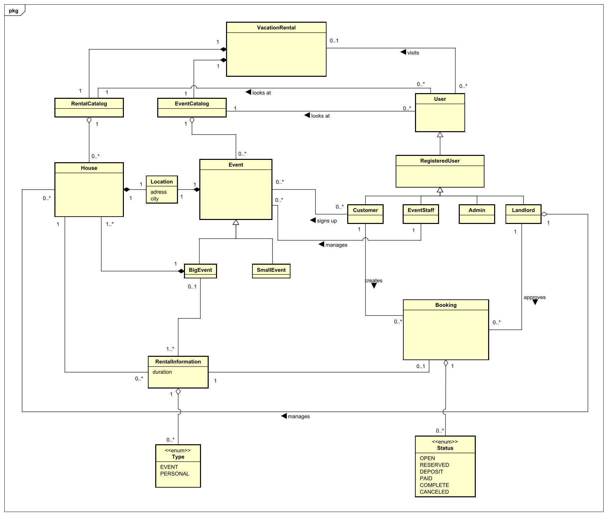

[[Klassenbeschreibung]]
=== Klassen und Enumerationen
Dieser Abschnitt stellt eine Vereinigung von Glossar und der Beschreibung von Klassen/Enumerationen dar. Jede Klasse und Enumeration wird in Form eines Glossars textuell beschrieben. Zusätzlich werden eventuellen Konsistenz- und Formatierungsregeln aufgeführt.

// See http://asciidoctor.org/docs/user-manual/#tables
[options="header"]
|===
|Klasse/Enumeration |Beschreibung
|VacationRental     |Zentrale Klasse des Systems repräsentiert die gesamte Ferienhausverwaltung.
|User               |Repräsentiert eine generelle Person, welche Benutzer des Systems.
|RegisteredUser     |Repräsentiert einen verifizierten Benutzer des Systems.
|Admin              |Ein Administrator des Systems, welcher die Benutzer verwaltet.
|Landlord           |Ein Vermieter, der Häuser verwaltet und anbietet.
|EventStaff         |Ein Eventmitarbeiter der Firma, der Events verwaltet und erstellen kann.
|Customer           |Ein angemeldeter Kunde, der Häuser und Events reservieren und buchen kann.
|RentalCatalog      |Ein Katalog, welcher ausgewählte Häuser anzeigt.
|EventCatalog       |Ein Katalog, welcher ausgewählte Events anzeigt.
|House              |Ein Haus, welches man mieten kann.
|Event              |Ein generelles Event.
|BigEvent           |Ein großes Event, eine genauere Ausprägung des Events. Diesem ist mindestens ein Haus zugeordnet und man muss es zu einem Haus dazu buchen.
|SmallEvent         |Ein kleines Event, eine genauere Ausprägung des Events. Diesem ist kein Haus zugeordnet.
|Location           |Beschreibt einen Ort, an dem ein Event stattfindet, oder ein  Haus steht.
|Booking            |Eine Buchung, die ein Kunde (Benutzer) tätigt, um ein Haus zu mieten.
|RentalInformation  |Repräsentiert den Zeitraum in dem ein Event, oder eine persönliche Buchung auf einem Haus eingetragen ist.
|Type              |Eine Enumeration, die beschreibt, ob eine Buchung von einem Event (EVENT), oder von einem User kommt (PERSONAL).
|Status            |Eine Enumeration, die die verschiedenen Status von Buchungen beschreibt. +
OPEN: Die Reservierung ist noch nicht bestätigt. +
RESERVED: Die Reservierung wurde vom Landlord bestätigt. +
DEPOSIT: Der Kunde hat eine Anzahlung geleistet. +
PAID: Die Buchung wurde vollständig bezahlt. +
COMPLETED: Die Buchung wurde abgeschlossen. +
CANCELED: Die Buchung wurde storniert. +
|===

== Akzeptanztestfälle
Dieser Abschnitt behandelt Akzeptanztests zur Überprüfung der funktionalen Anforderungen der Software. Die Tests leiten sich von Anwendungsfallbeschreibungen und UML-Sequenzdiagrammen ab. Jeder Anwendungsfall hat mindestens ein Sequenzdiagramm, aus dem ein Akzeptanztestfall entsteht, der in einer Tabelle mit einer ID zur Referenzierung aufgeführt wird.
//navi - Regist
//Registrieren AT000x
[[AT0001]]
[cols="1h, 4"]
|===
|ID            |<<AT0001>>
|Use Case      |<<UC0011>>
|Vorbedingung         a|ein nicht registrierter Benutzer besucht die Seite
|Event       a|
klickt auf "Registrieren" in der Navigationsleiste.

|Ergebnis      a|
- wird zur Registrieren-Seite umgeleitet.
|=== 

[[AT0002]]
[cols="1h, 4"]
|===
|ID            |<<AT0002>>
|Use Case      |<<UC0011>>
|Vorbedingung         a|<<AT0001>> auf  Registrieren Seite
|Event       a|Benutzer gibt hier alle Registrierungsinformationen ein:

- Benutzername: test123
- Passwort: 1234abcd
- Adresse: test straße 1

Und klickt auf "Registrieren".

|Ergebnis      a|
- Neuer Benutzer Account wird erstellt, durch _@Admin_ aktiviert
- Benutzer bleibt unauthentifiziert und wird zur Startseite umgeleitet.
|=== 

[[AT0003]]
[cols="1h, 4"]
|===
|ID            |<<AT0003>>
|Use Case      |<<UC0011>>
|Vorbedingung         a|<<AT0002>> schon existierender registrierter Account 
|Event       a|Benutzer gibt hier alle Registrierungsinformationen ein:

- Benutzername: test123
- Passwort: _valides Password_
- Adresse: _valide Adresse_

Und klickt auf "Registrieren".

|Ergebnis      a|
- Neuer Benutzer Account wird nicht erstellt
- Fehlermeldung "Name bereits vergeben"
|=== 

[[AT0004]]
[cols="1h, 4"]
|===
|ID            |<<AT0004>>
|Use Case      |<<UC0011>>
|Vorbedingung         a|<<AT0001>> auf  Registrieren Seite
|Event       a|Benutzer gibt hier nicht alle Registrierungsinformationen ein:

- Benutzername: _kein Name_
- Passwort: 1234abcd
- Adresse: test straße 1

Und klickt auf "Registrieren".

|Ergebnis      a|
- Neuer Benutzer Account wird nicht erstellt
- Fehlermeldung "Bitte Name eingeben"
|=== 

[[AT0005]]
[cols="1h, 4"]
|===
|ID            |<<AT0005>>
|Use Case      |<<UC0011>>
|Vorbedingung         a|<<AT0001>> auf  Registrieren Seite
|Event       a|Benutzer gibt hier nicht alle Registrierungsinformationen ein:

- Benutzername: test123
- Passwort: _kein Password_
- Adresse: test straße 1

Und klickt auf "Registrieren".

|Ergebnis      a|
- Neuer Benutzer Account wird nicht erstellt
- Fehlermeldung "Bitte Passwort eingeben"
|=== 

[[AT0006]]
[cols="1h, 4"]
|===
|ID            |<<AT0006>>
|Use Case      |<<UC0011>>
|Vorbedingung         a|<<AT0001>> auf  Registrieren Seite
|Event       a|Benutzer gibt hier nicht alle Registrierungsinformationen ein:

- benutzername: test123
- Passwort: 123
- Adresse: test straße 1

Und klickt auf "Registrieren".

|Ergebnis      a|
- Neuer Benutzer Account wird nicht erstellt
- Fehlermeldung "Passwort zu kurz. Mind. 8 Zeichen eingeben"
|=== 

[[AT0007]]
[cols="1h, 4"]
|===
|ID            |<<AT0007>>
|Use Case      |<<UC0011>>
|Vorbedingung         a|<<AT0001>> auf  Registrieren Seite
|Event       a|Benutzer gibt hier nicht alle Registrierungsinformationen ein:

- Benutzername: test123
- Passwort: 1234@_asv€
- Adresse: test straße 1

Und klickt auf "Registrieren".

|Ergebnis      a|
- Neuer Benutzer Account wird nicht erstellt
- Fehlermeldung "Passwort enthält unerlaubte Zeichen"
|===

//navi - Login
//Login  AT001x
[[AT0010]]
[cols="1h, 4"]
|===
|ID            |<<AT0010>>
|Use Case      |<<UC0012>>
|Vorbedingung         a|ein Benutzer besucht die Seite
|Event       a|
klickt auf "Login" in der Navigationsleiste.

|Ergebnis      a|
- wird zur Loginseite umgeleitet.
|=== 

//erfolgreicher Login
[[AT0011]]
[cols="1h, 4"]
|===
|ID            |<<AT0011>>
|Use Case      |<<UC0012>>
|Vorbedingung         a|
- <<AT0010>> ist erfolgt. (auf Login Seite)
- Registrierten Accounts wie <<AT0002>> sind vorhanden

|Event       a|Benutzer gibt hier alle Login informationen ein:

- Benutzername: test123
- Passwort: 1234abcd

Und klickt auf "Login".

|Ergebnis      a|
- Benutzer wird authentifiziert und wird zur Startseite umgeleitet.
- Der Benutzer wird auf seinen Account eingeloggt (mit seiner Rolle)
|===

//Edge case
[[AT0012]]
[cols="1h, 4"]
|===
|ID            |<<AT0012>>
|Use Case      |<<UC0012>>
|Vorbedingung         a|
- <<AT0010>> ist erfolgt. (auf Login Seite)
- keine registrierten Accounts wie <<AT0002>> vorhanden

|Event       a|Benutzer gibt hier alle Login Informationen ein:

- Benutzername: test123
- Passwort: 1234abcd

Und klickt auf "Login".

|Ergebnis      a|
- Fehlermeldung "Der eingegebene Name oder das Passwort ist ungültig."
|=== 
 

//Falscher Benutzername
[[AT0013]]
[cols="1h, 4"]
|===
|ID            |<<AT0013>>
|Use Case      |<<UC0012>>
|Vorbedingung         a|
- <<AT0010>> ist erfolgt. (auf Login Seite)
- Registrierten Accounts wie <<AT0002>> sind vorhanden

|Event       a|Benutzer gibt hier alle Login Informationen ein:

- Benutzername: 123test
- Passwort: 1234abcd

Und klickt auf "Login".

|Ergebnis      a|
- Fehlermeldung "Der eingegebene Name oder das Passwort ist ungültig."
|=== 

//Falsches Password
[[AT0014]]
[cols="1h, 4"]
|===
|ID            |<<AT0014>>
|Use Case      |<<UC0012>>
|Vorbedingung         a|
- <<AT0010>> ist erfolgt. (auf Login Seite)
- Registrierten Accounts wie <<AT0002>> sind vorhanden

|Event       a|Benutzer gibt hier alle Login Informationen ein:

- Benutzername: test123
- Passwort: abcd1234

Und klickt auf "Login".

|Ergebnis      a|
- Fehlermeldung "Der eingegebene Name oder das Passwort ist ungültig."
|=== 

//Logout AT002x
[[AT0020]]
[cols="1h, 4"]
|===
|ID            |<<AT0020>>
|Use Case      |<<UC0013>>
|Vorbedingung         a|
- <<AT0011>> ist bereits erfolgt. (Schon Eingeloggt)

|Event       a|Benutzer klickt auf "Logout" in der Navigationsleiste.

|Ergebnis      a|
- Der Benutzer wird aus seinem Account ausgeloggt (mit seiner Rolle)/ verliert alle rechte
- Benutzer wird unauthentifiziert und wird zur Startseite umgeleitet.
|=== 

//navi - Haus 
//Catalog-haus AT01yx wobei y unterschiedliche rollen sind 
[[AT0100]]
[cols="1h, 4"]
|===
|ID            |<<AT0100>>
|Use Case      |<<UC0021>>
|Vorbedingung         a|ein Benutzer besucht die Seite
|Event       a|
klickt auf "Häuser" in der Navigationsleiste.

|Ergebnis      a|
- wird zur Häuserseite umgeleitet.
|=== 

[[AT0101]]
[cols="1h, 4"]
|===
|ID            |<<AT0101>>
|Use Case      |<<UC0022>>
|Vorbedingung         a|<<AT0100>> auf Häuser Seite 
|Event       a|
klickt auf eines der Häuser, um mehr Informationen zu erhalten.

|Ergebnis      a|
- wird zur spez. Häuser Seite umgeleitet. (Hausdetails)
|=== 

//navi - Landlord

[[AT0110]]
[cols="1h, 4"]
|===
|ID            |<<AT0110>>
|Use Case      |<<UC0021>>
|Vorbedingung         a|Benutzer <<AT0011>> mit Rolle _@Landlord_
|Event       a|
klickt auf "Häuserverwalten" in der Navigationsleiste.

|Ergebnis      a|
- wird zur Häuserverwalten-Seite umgeleitet.
|=== 

//Add DNI
[[AT0111]]
[cols="1h, 4"]
|===
|ID            |<<AT0111>>
|Use Case      |<<UC0023>>
|Vorbedingung         a|- Benutzer <<AT0011>> mit Rolle _@Landlord_
- <<AT0110>>  auf Häuserverwalten Seite 
|Event       a|
klickt auf "Haus hinzufügen" auf der Seite
|Ergebnis      a|
- wird zur Häuserverwalten-Seite umgeleitet. // bekommt Popup wie "Kommentar"
|=== 

//Edit DNI
[[AT0112]]
[cols="1h, 4"]
|===
|ID            |<<AT0112>>
|Use Case      |<<UC0024>>
|Vorbedingung         a|- Benutzer <<AT0011>> mit Rolle _@Landlord_
- <<AT0110>>  auf Häuserverwalten Seite 
|Event       a|
klickt auf "Haus bearbeiten" auf der Seite
|Ergebnis      a|
- wird zur Häuserverwalten-Seite umgeleitet. // bekommt Popup wie "Kommentar"
|=== 

//Del DNI
[[AT0113]]
[cols="1h, 4"]
|===
|ID            |<<AT0113>>
|Use Case      |<<UC0025>>
|Vorbedingung         a|- Benutzer <<AT0011>> mit Rolle _@Landlord_
- <<AT0110>>  auf Häuserverwalten Seite 
|Event       a|
klickt auf "Haus löschen" auf der Seite
|Ergebnis      a|
- wird zur Häuserverwalten-Seite umgeleitet. // bekommt Popup wie "Kommentar"
|=== 

//ViewHistory DNI
[[AT0114]]
[cols="1h, 4"]
|===
|ID            |<<AT0114>>
|Use Case      |<<UC0026>>
|Vorbedingung         a|- Benutzer <<AT0011>> mit Rolle _@Landlord_
- <<AT0110>>  auf Häuserverwalten 
|Event       a|
klickt auf "Haus history" auf der Seite
|Ergebnis      a|
- wird zur Häuserverwalten-Seite umgeleitet. // bekommt Popup wie "Kommentar"
|=== 

//Add / edit check DNI addOrUpdate() success
[[AT0115]]
[cols="1h, 4"]
|===
|ID            |<<AT0115>>
|Use Case      |<<UC0023>> & <<UC0024>>
|Vorbedingung         a|- Benutzer <<AT0011>> mit Rolle _@Landlord_
- <<AT0110>>  auf Häuserverwalten Seite 
|Event       a|
- Address: Hausstraße 5
- City: Dresden
- Preis: 125

|Ergebnis      a|
- Haus wird erfolgreich hinzugefügt oder bearbeitet (Je nachdem welcher Knopf)
|=== 

//Add / edit check DNI addOrUpdate() 
[[AT0116]]
[cols="1h, 4"]
|===
|ID            |<<AT0116>>
|Use Case      |<<UC0023>> & <<UC0024>>
|Vorbedingung         a|- Benutzer <<AT0011>> mit Rolle _@Landlord_
- <<AT0110>>  auf Häuserverwalten Seite
|Event       a|
- Address: _keine Adresse_
- City: Dresden
- Preis: 125

|Ergebnis      a|
- Fehlermeldung "Adresse fehlt"
- Haus wird nicht hinzugefügt oder bearbeitet (Je nachdem welcher Knopf)
|=== 

//Add / edit check DNI addOrUpdate() 
[[AT0117]]
[cols="1h, 4"]
|===
|ID            |<<AT0117>>
|Use Case      |<<UC0023>> & <<UC0024>>
|Vorbedingung         a|- Benutzer <<AT0011>> mit Rolle _@Landlord_
- <<AT0110>>  auf Häuserverwalten Seite
|Event       a|
- Adresse: Hausstraße 5
- Stadt: _keine Stadt_
- Preis: 125

|Ergebnis      a|
- Fehlermeldung "Stadt fehlt"
- Haus wird nicht hinzugefügt oder bearbeitet (Je nachdem welcher Knopf)
|=== 

//Add / edit check DNI addOrUpdate() 
[[AT0118]]
[cols="1h, 4"]
|===
|ID            |<<AT0118>>
|Use Case      |<<UC0023>> & <<UC0024>>
|Vorbedingung         a|- Benutzer <<AT0011>> mit Rolle _@Landlord_
- <<AT0110>>  auf Häuserverwalten Seite
|Event       a|
- Adresse: Hausstraße 5
- Stadt: Dresden
- Preis: _kein Preis_

|Ergebnis      a|
- Fehlermeldung "Preis fehlt"
- Haus wird nicht hinzugefügt oder bearbeitet (Je nachdem welcher Knopf)
|=== 

//Add / edit check DNI addOrUpdate() minPreis()
[[AT0119]]
[cols="1h, 4"]
|===
|ID            |<<AT0119>>
|Use Case      |<<UC0023>> & <<UC0024>>
|Vorbedingung         a|- Benutzer <<AT0011>> mit Rolle _@Landlord_
- <<AT0110>>  auf Häuserverwalten Seite
|Event       a|
- Adresse: Hausstraße 5
- Stadt: Dresden
- Preis: _0_

|Ergebnis      a|
- Fehlermeldung "Mindestpreis von _x_  nicht erfüllt. Preis auf mindestens _x_ setzen"
- Haus wird nicht hinzugefügt oder bearbeitet (Je nachdem welcher Knopf)
|=== 

//navi - Event

//Catalog-haus AT02xx 
[[AT0200]]
[cols="1h, 4"]
|===
|ID            |<<AT0200>>
|Use Case      |<<UC0042>>
|Vorbedingung         a|ein Benutzer besucht die Seite
|Event       a|
klickt auf "Events" in der Navigationsleiste.

|Ergebnis      a|
- wird zur Eventseite umgeleitet.
|=== 

[[AT0201]]
[cols="1h, 4"]
|===
|ID            |<<AT0201>>
|Use Case      |<<UC0041>>
|Vorbedingung         a|- Benutzer <<AT0011>> mit Rolle _@Customer_
- <<AT0200>> Event Seite
|Event       a|
klickt auf "Event Ticket hinzufügen" auf der Seite.

|Ergebnis      a|
- Event Ticket wird zur buchung hinzugefügt.
|=== 

// edit
[[AT0202]]
[cols="1h, 4"]
|===
|ID            |<<AT0202>>
|Use Case      |<<UC0042>>
|Vorbedingung         a|- Benutzer <<AT0011>> mit Rolle _@EventStaff_
- <<AT0200>> ist auf der Event Seite
|Event       a|
klickt auf "Event bearbeiten" auf der Seite
|Ergebnis      a|
- wird zur Eventseite umgeleitet. // bekommt Popup wie "Kommentar"
|=== 

//create (add)
[[AT0203]]
[cols="1h, 4"]
|===
|ID            |<<AT0203>>
|Use Case      |<<UC0047>>
|Vorbedingung         a|- Benutzer <<AT0011>> mit Rolle _@EventStaff_
- <<AT0200>> ist auf der Event Seite
|Event       a|
klickt auf "Event erstellen" auf der Seite
|Ergebnis      a|
- wird zur Eventseite umgeleitet. // bekommt Popup wie "Kommentar"
|===

//del
[[AT0204]]
[cols="1h, 4"]
|===
|ID            |<<AT0204>>
|Use Case      |<<UC0043>>
|Vorbedingung         a|- Benutzer <<AT0011>> mit Rolle _@EventStaff_
- <<AT0200>> ist auf der Event Seite
|Event       a|
klickt auf "Event löschen" auf der Seite
|Ergebnis      a|
- wird zur Eventseite umgeleitet. // bekommt Popup wie "Kommentar"
|===

//request
[[AT0205]]
[cols="1h, 4"]
|===
|ID            |<<AT0205>>
|Use Case      |<<UC0046>>
|Vorbedingung         a|- Benutzer <<AT0011>> mit Rolle _@EventStaff_
- <<AT0200>> ist auf der Event Seite
- <<AT0203>> existierendes Event
|Event       a|
- klickt auf "Häuser anfragen" auf der Seite +
- wählt Häuser in der Nähe aus +
- klickt auf "Anfrage(n) abschicken"

|Ergebnis      a|
- ausgewählte Hauseigentümer (Account mit _@Landlord_) von Häusern in der Nähe erhalten Anfrage
|===

//approve success
[[AT0206]]
[cols="1h, 4"]
|===
|ID            |<<AT0206>>
|Use Case      |<<UC0045>>
|Vorbedingung         a|- Benutzer <<AT0011>> mit Rolle _@Landlord_
- <<AT0200>> ist auf der Event Seite
- <<AT0203>> & <<AT0205>> existierendes & request Event
|Event       a|
klickt auf "Anfrage akzeptieren" auf der Seite
|Ergebnis      a|
- Haus wird dem Event zur Verfügung gestellt
- Haus wird in der Eventliste angezeigt
- _@EventStaff_ des request wird benachrichtigt mit "JA"
|===

[[AT0207]]
[cols="1h, 4"]
|===
|ID            |<<AT0207>>
|Use Case      |<<UC0045>>
|Vorbedingung         a|- Benutzer <<AT0011>> mit Rolle _@Landlord_
- <<AT0200>> ist auf der Event Seite
- <<AT0203>> & <<AT0205>> existierendes & request Event
|Event       a|
klickt auf "Anfrage ablehnen" auf der Seite
|Ergebnis      a|
- Haus wir dem Event nicht zur Verfügung gestellt
- _@EventStaff_ des request wird benachrichtigt mit "NEIN"
|===

//del - 
[[AT0208]]
[cols="1h, 4"]
|===
|ID            |<<AT0208>>
|Use Case      |<<UC0045>>
|Vorbedingung         a|- Benutzer <<AT0011>> mit Rolle _@EventStaff_
- <<AT0200>> ist auf der Event Seite
- <<AT0203>> & <<AT0201>> existierendes & gebuchtes Event
|Event       a|
- <<AT0204>> beim Löschen
|Ergebnis      a|
- Event wird gelöscht
- _@Customer_ welche das Event schon gebucht haben werden benachrichtigt, "das Event wurde gelöscht"
- Sie (_@Customer_) erhalten ihr bereits bezahltes Geld zurück
|===

//Add / edit check DNI addOrUpdate()  success
[[AT0210]]
[cols="1h, 4"]	
|===
|ID            |<<AT0210>>
|Use Case      |<<UC0042>> & <<UC0047>>
|Vorbedingung         a|- Benutzer <<AT0011>> mit Rolle _@EventStaff_
- <<AT0200>> ist auf der Event Seite
|Event       a|
- Adresse: Hausstraße 9
- Stadt: Dresden
- Preis: 25

|Ergebnis      a|
- Event wird erfolgreich hinzugefügt oder bearbeitet (Je nachdem welcher Knopf)
|=== 

//Add / edit check DNI addOrUpdate()
[[AT0211]]
[cols="1h, 4"]
|===
|ID            |<<AT0211>>
|Use Case      |<<UC0042>> & <<UC0047>>
|Vorbedingung         a|- Benutzer <<AT0011>> mit Rolle _@EventStaff_
- <<AT0200>> ist auf der Event Seite
|Event       a|
- Adresse: _keine Adresse_
- Stadt: Dresden
- Preis: 25

|Ergebnis      a|
- Fehlermeldung "Bitte Adresse eingeben"    
- Haus wird nicht hinzugefügt oder bearbeitet (Je nachdem welcher Knopf)
|=== 

//Add / edit check DNI addOrUpdate()
[[AT0212]]
[cols="1h, 4"]
|===
|ID            |<<AT0212>>
|Use Case      |<<UC0042>> & <<UC0047>>
|Vorbedingung         a|- Benutzer <<AT0011>> mit Rolle _@EventStaff_
- <<AT0200>> ist auf der Event Seite
|Event       a|
- Adresse: Hausstraße 9
- Stadt: _keine Stadt_
- Preis: 25

|Ergebnis      a|
- Fehlermeldung "Bitte Stadt eingeben"
- Haus wird nicht hinzugefügt oder bearbeitet (Je nachdem welcher Knopf)
|=== 

//Add / edit check DNI addOrUpdate()
[[AT0213]]
[cols="1h, 4"]
|===
|ID            |<<AT0213>>
|Use Case      |<<UC0042>> & <<UC0047>>
|Vorbedingung         a|- Benutzer <<AT0011>> mit Rolle _@EventStaff_
- <<AT0200>> ist auf der Event Seite
|Event       a|
- Adresse: Hausstraße 9
- Stadt: Dresden
- Preis: _kein Preis_

|Ergebnis      a|
- Fehlermeldung "Bitte Preis eingeben"
- Haus wird nicht hinzugefügt oder bearbeitet (Je nachdem welcher Knopf)
|=== 

//navi - Admin
[[AT0300]]
[cols="1h, 4"]
|===
|ID            |<<AT0300>>
|Use Case      |<<UC0017>>
|Vorbedingung         a|- Benutzer <<AT0011>> mit Rolle _@Admin_
|Event       a|
klickt auf "Benutzer verwalten" auf der Navigationsleiste
|Ergebnis      a|
- wird zur Benutzerübersicht Seite umgeleitet.
|=== 

// create Landlord
[[AT0301]]
[cols="1h, 4"]
|===
|ID            |<<AT0301>>
|Use Case      |<<UC0016>>
|Vorbedingung         a|- Benutzer <<AT0011>> mit Rolle _@Admin_
- <<AT0300>> ist auf der Benutzer Übersicht Seite
|Event       a|
klickt auf "Account Erstellen" auf der Seite mit Informationen:
- Benutzername: landTest1
- Passwort: 1234abcd
- Adresse: test straße 1
- Rolle: _@Landlord_ 
|Ergebnis      a|
- Account wird mit Rolle: _@Landlord_ erstellt mit entsprechender Rolle
|=== 

// create EventStuff
[[AT0302]]
[cols="1h, 4"]
|===
|ID            |<<AT0302>>
|Use Case      |<<UC0016>>
|Vorbedingung         a|- Benutzer <<AT0011>> mit Rolle _@Admin_
- <<AT0300>> ist auf der Benutzer Übersicht Seite
|Event       a|
klickt auf "Account Erstellen" auf der Seite mit Information:
- Benutzername: landTest1
- Passwort: 1234abcd
- Adresse: test straße 1
- Rolle: _@EventStaff_
|Ergebnis      a|
- Account wird mit Rolle: _@EventStaff_ erstellt mit entsprechender Rolle
|=== 

//del
[[AT0303]]
[cols="1h, 4"]
|===
|ID            |<<AT0302>>
|Use Case      |<<UC0015>>
|Vorbedingung         a|- Benutzer <<AT0011>> mit Rolle _@Admin_
- <<AT0300>> ist auf der Benutzer Übersicht Seite
- <<AT0002>> erstellter Customer Account
|Event       a|
klickt auf "Account Löschen" auf der Seite 
|Ergebnis      a|
- Account wird gelöscht 
|=== 

//aktivieren
[[AT0304]]
[cols="1h, 4"]
|===
|ID            |<<AT0304>>
|Use Case      |<<UC0014>>
|Vorbedingung         a|- Benutzer <<AT0011>> mit Rolle _@Admin_
- <<AT0300>> ist auf der Benutzer Übersicht Seite
- <<AT0002>> erstellter Account
|Event       a|
klickt auf "Account aktivieren" auf der Seite 
|Ergebnis      a|
- Account wird Freigeschaltet
|=== 

//navi - Buchung

[[AT0400]]
[cols="1h, 4"]
|===
|ID            |<<AT0400>>
|Use Case      |<<UC0037>>
|Vorbedingung         a|ein Benutzer _@Customer_ besucht die Seite
|Event       a|
klickt auf "Buchung" in der Navigationsleiste.

|Ergebnis      a|
- wird zur Buchung Seite umgeleitet.
|=== 

[[AT0401]]
[cols="1h, 4"]
|===
|ID            |<<AT0401>>
|Use Case      |<<UC0031>>
|Vorbedingung         a|- ein Benutzer _@Customer_
- <<AT0400>> auf  Buchung Seite oder auf spez. Hausseite<<AT0101>>
|Event       a|
- wählt Zeitraum
- klickt auf "Für ausgewählten Zeitraum reservieren" auf der Seite

|Ergebnis      a|
- Haus wird vorerst "reserviert" für den Zeitraum
- wird zur Buchung Seite umgeleitet.
|=== 

[[AT0402]]
[cols="1h, 4"]
|===
|ID            |<<AT0402>>
|Use Case      |<<UC0033>>
|Vorbedingung         a|- ein Benutzer _@Customer_
- <<AT0400>> auf  Buchung Seite
- hat ein Haus in der Buchung hinzugefügt
- kann Events enthalten
|Event       a|
- gibt Zeitraum ein (wenn noch keiner vorhanden)
- Kontodaten & persönliche Informationen
klickt auf "Buchen" auf der Seite

|Ergebnis      a|
- Haus wird vorerst "reserviert" für den Zeitraum
- wird aufgefordert eine Anzahlung von 10 % zu leisten <<UC0032>>
- eventuelle Events werden mit gebucht
|=== 

[[AT0403]]
[cols="1h, 4"]
|===
|ID            |<<AT0403>>
|Use Case      |<<UC0032>>
|Vorbedingung         a|- ein Benutzer _@Customer_
- <<AT0400>> auf  Buchungsseite
- <<AT0402>> 1. Buchungsschritt schon erfüllt
|Event       a|
- bezahlt Deposit

|Ergebnis      a|
- _@Landlord_ wird benachrichtigt das Haus _x_ gebucht wird
- Der _@Customer_ überweist 10 % der Gesamtkosten an den _@Landlord_
|=== 

[[AT0404]]
[cols="1h, 4"]
|===
|ID            |<<AT0404>>
|Use Case      |<<UC0034>>
|Vorbedingung         a|- ein Benutzer _@Landlord_
- <<AT0400>> auf  Buchungsseite
- <<AT0402>> 2. Buchungsschritt erfüllt
|Event       a|
- Stimmt Buchung zu
|Ergebnis      a|
- Buchungsinformationen an beide Parteien 
|=== 

[[AT0405]]
[cols="1h, 4"]
|===
|ID            |<<AT0405>>
|Use Case      |<<UC0034>>
|Vorbedingung         a|- ein Benutzer _@Landlord_
- <<AT0400>> auf  Buchungsseite
- <<AT0402>> 2. Buchungsschritt erfüllt
|Event       a|
- Stimmt Buchung nicht zu

|Ergebnis      a|
- Buchung Storniert
- was in <<UC0036>> beschrieben zur Folge hat
|=== 

//Landlord cancelt booking 
[[AT0406]]
[cols="1h, 4"]
|===
|ID            |<<AT0406>>
|Use Case      |<<UC0036>>
|Vorbedingung         a|- ein Benutzer _@Landlord_
- <<AT0400>> auf  Buchungsseite
- <<AT0402>> 2. Buchungsschritt erfüllt

|Event       a|
- Der Vermieter _@Landlord_ storniert die Buchung bzw. Stimmt ihr nicht zu
|Ergebnis      a|
- _@Customer_ wird benachrichtigt
- _@Customer_ erhält sein deposit zurück, (10 %) von _@Landlord_
- "Reserviert" Status des Hauses geht wieder über zu frei
|=== 

//Customer cancelt booking within timelimit
[[AT0407]]
[cols="1h, 4"]
|===
|ID            |<<AT0407>>
|Use Case      |<<UC0036>>
|Vorbedingung         a|- ein Benutzer _@Customer_
- <<AT0400>> auf  Buchungsseite
- <<AT0402>> 2. Buchungsschritt erfüllt
- gebucht von 01.02.2025
- gebucht bis 01.03.2025
- heute 01.01.2025, Deadline: 7 Tage vor Buchungsbeginn

|Event       a|
- Der Kunde _@Customer_ storniert die Buchung
|Ergebnis      a|
- _@Landlord_ wird benachrichtigt
- _@Customer_ erhält sein deposit zurück, (10 %) von _@Landlord_
- Haus "reserviert" für den Zeitraum von 01.02.2025 bis 01.03.2025 wird wieder zu frei
|=== 

//Customer cancelt booking outside the timelimit
[[AT0408]]
[cols="1h, 4"]
|===
|ID            |<<AT0408>>
|Use Case      |<<UC0036>>
|Vorbedingung         a|- ein Benutzer _@Customer_
- <<AT0400>> auf  Buchungsseite
- <<AT0402>> 2. Buchungsschritt erfüllt
- gebucht von 01.02.2025
- gebucht bis 01.03.2025
- heute 28.01.2025, Deadline: 7 Tage vor Buchungsbeginn

|Event       a|
- Der Kunde _@Customer_ storniert die Buchung
|Ergebnis      a|
- _@Landlord_ wird benachrichtigt
- _@Customer_ erhält sein deposit nicht zurück, (10 %) bleiben bei _@Landlord_
- Haus "reserviert" für den Zeitraum von 01.02.2025 bis 01.03.2025 wird wieder zu frei
|=== 

[[AT0409]]
[cols="1h, 4"]
|===
|ID            |<<AT0409>>
|Use Case      |<<UC0035>>
|Vorbedingung         a|- ein Benutzer _@Landlord_
- <<AT0400>> auf  Buchungsseite
- <<UC0036>>
- gebucht von 01.02.2025
- gebucht bis 01.03.2025
- heute 01.01.2025, Deadline: 7 Tage vor Buchungsbeginn

|Event       a|
- Der Vermieter _@Landlord_ reagiert auf Stornierung innerhalb der Deadline
|Ergebnis      a|
- _@Customer_ erhält sein deposit zurück, (10 %) von _@Landlord_
|=== 

[[AT0410]]
[cols="1h, 4"]
|===
|ID            |<<AT0410>>
|Use Case      |<<UC0035>>
|Vorbedingung         a|- ein Benutzer _@Landlord_
- <<AT0400>> auf  Buchungsseite
- <<UC0036>>
- gebucht von 01.02.2025
- gebucht bis 01.03.2025
- heute 28.01.2025, Deadline: 7 Tage vor Buchungsbeginn

|Event       a|
- Der Vermieter _@Landlord_ reagiert auf Stornierung nach der Deadline
|Ergebnis      a|
- _@Customer_ erhält sein deposit nicht zurück, (10 %) bleiben beim _@Landlord_
|===

== Glossar
Hier werden sämtliche Begriffe, die innerhalb des Projektes verwendet werden und deren gemeinsames Verständnis aller beteiligten
Stakeholder essenziell ist, aufgeführt.

[options="header", cols="1h, 4"]
[[glossar]]
|===
|Begriff                |Beschreibung
|Kunde                  |Customer, siehe <<Klassenbeschreibung>>.
|Vermieter              |Landlord, siehe <<Klassenbeschreibung>>.
|Benutzer /unauthentifiziert Benutzer        |User, siehe <<Klassenbeschreibung>>.
|Admin                  |Admin, siehe <<Klassenbeschreibung>>.
|Haus                   |House, siehe <<Klassenbeschreibung>>.
|Eventmitarbeiter       |EventStaff, siehe <<Klassenbeschreibung>>.
|Buchung                |Booking, siehe <<Klassenbeschreibung>>.
|Reservierung           |Reservation, siehe <<Klassenbeschreibung>>.
|Anzahlung              |Deposit, siehe <<Klassenbeschreibung>>.
|Großes Event           |BigEvent, siehe <<Klassenbeschreibung>>.
|Kleines Event          |SmallEvent, siehe <<Klassenbeschreibung>>.
|Ort                    |Location, siehe <<Klassenbeschreibung>>.
|Buchungsstatus         |Status, siehe <<Klassenbeschreibung>>.
|Buchungsinformationen  |RentalInformation, siehe <<Klassenbeschreibung>>.
|Buchungstyp            |Type, siehe <<Klassenbeschreibung>>.
|System                 |Die zu entwickelnde Software, für die Firma "Elbtal-Genuss".
|Account / Konto        |RegisteredUser, siehe <<Klassenbeschreibung>>.
|Benutzer               |Angemeldeter Besucher der Seite.
|Nutzer                 |Nicht angemeldeter Besucher der Seite.
|Rental Shop            |Fasst die Grundkomponenten wie Startseite, Registrierung und Login zusammen.
|House Management       |Fasst alle Komponenten zusammen, die für die Häuserverwaltung relevant sind (z.B. Häuser hinzufügen, ändern oder löschen).
|Event Management       |Fasst alle Komponenten zusammen, die für die Eventverwaltung relevant sind (z.B. Events erstellen, ändern, absagen oder Häuser anfragen).
|User Management        |Fasst alle Komponenten zusammen, die für die Nutzerverwaltung relevant sind (z.B. Benutzer freischalten, erstellen oder löschen).
|===

== Offene Punkte
Offene Punkte werden entweder direkt in der Spezifikation notiert. Wenn das Pflichtenheft zum finalen Review vorgelegt wird, sollte es keine offenen Punkte mehr geben.

